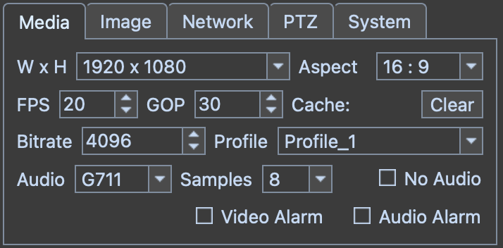
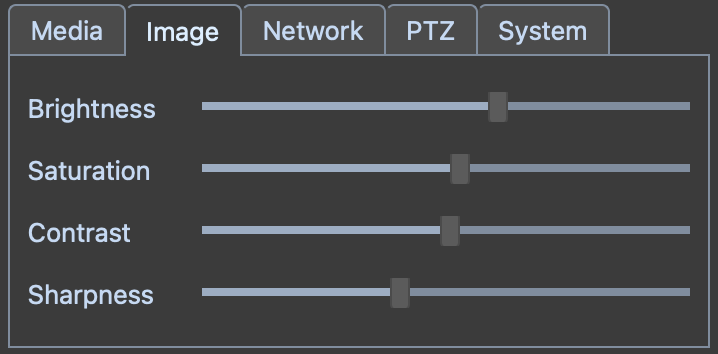
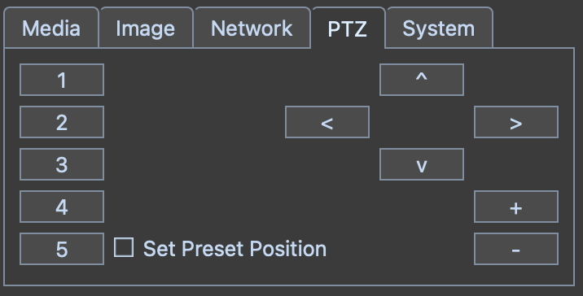
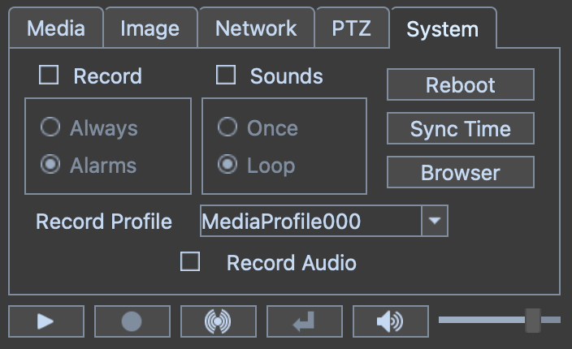
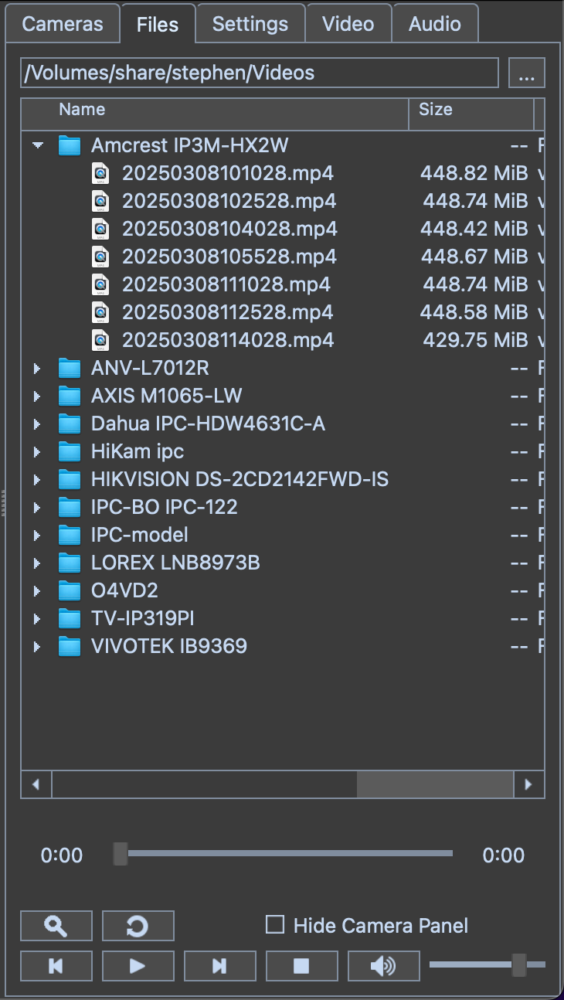

libonvif
========

A client side implementation of the ONVIF specification for Linux, Mac and Windows. Included are two tools for communicating with cameras, a command line program, onvif-util, and a program with a Graphical User Interface, onvi-gui.

&nbsp;

<!---
<table>
  <tr><td><image src="onvif-gui/gui/resources/onvif-gui.png"></td><td><h2>Onvif GUI</h2><br>Featuring<br><a href="https://github.com/Megvii-BaseDetection/YOLOX"><image src="assets/images/logo.png"  width="200"></a></td></tr>
<table>
--->

<image src="assets/images/header.png">

&nbsp;

## Introduction

<details>
<summary>Description</summary>
&nbsp;

Onvif GUI is an integrated camera management system with an intuitive user interface that can be easily installed and configured on a wide variety of hardware, including Windows, Mac and Linux. Built in AI can accurately detect objects of interest and raise alarms to alert users and start recording high resolution streams to disk for archive.

The system is designed to scale with available hardware and will run on simple configurations as well as high end systems for maximum performance. Onvif GUI can be arranged in a client server configuration where a host computer can manange connections to a group of cameras which are isolated from the rest of the network for improved security. Any number of client computers can then be used to observe the streams and recieve alarms generated by the server. In such a scenario, the compute load is concentrated on the server, and lower powered computers can be used as observation stations.

The system has integrated OpenVINO support for AI analysis on iGPU Intel hardware. It also will support Apple Silicon NPU AI, enabling high performance in low power environments. This allows users to select the level of hardware appropriate for their application. Apple M4 Mac Mini makes an excellent choice for low to medium power configurations such as a server mananging 12 cameras, for example. Intel Ultra Core series chips are also an excellent choice for a Windows based server managing a similar load. For maximum performance, a Linux server equipped with an NVIDIA GPU can be utilized to process data from a large fleet of cameras. 

The system can be configured with auto start settings and a user friendly icon so that non-technical users can feel comfortable working with the application without specialized training. File management is easy with an automated disk space manager and file playback controls. Multiple camera streams can be viewed in the display with a double click action to open a pop up window for displaying a high resolution stream for detailed viewing. Groups of cameras can be bundled together in different windows for display on multiple monitors from a single host computer.

---

&nbsp;

</details>

<details>
<summary>Screenshot</summary>
&nbsp;

Here is the application running 12 cameras on an Intel NUC with an i7 1360P acting as a host with the yolox detector using OpenVINO on the iGPU in Linux. The application has been configured to display the low resolution camera substreams in the main display on the right and the secondary window on the lower left is showing the high resolution display for a single camera as selected by double clicking the main display on the camera of interest. On the upper left is a separate system monitor application showing the compute load.

<image src="assets/images/screenshot.png">

&nbsp;

The equivalent configuration on the base model Mac Mini M4

<image src="assets/images/screenshot_mac.png">

&nbsp;

And the same for Windows on an Intel Core Ultra 9 185H

<image src="assets/images/screenshot_win.png">

---

&nbsp;

</details>

<details>
<summary>Recommended Configuration</summary>

&nbsp;

For maximum performance, the client-server configuration is recommended. Onvif GUI has a proxy server that will buffer the camera streams, providing a consistent low latency interface to the rest of the network. Additionally, this configuration isolates the cameras, blocking all traffic between the cameras and the internet. Isolating cameras on a private subnet may require a DHCP server for ip address assignments. It may also be possible to assign static IP addresses to all cameras, but a DHCP server is recommended. Please see DHCP Servers in the Notes section for detailed instructions on how to configure a DHCP server on the Onvif GUI host machine.

&nbsp;

<image src="assets/images/net_config.png" style="width: 640px;">

&nbsp;

It is not recommended to use a wireless connection for the server interface in most instances. Wireless cameras are not recommended. A 1 Gb network interface on the server should be sufficient to host a reasonable number of cameras. Wired network connections will result in a more stable and performant experience than wireless connections. Wireless connection stability can also vary widely depending on hardware and drivers. Recent Apple Silicon Mac computers had a noticeably better WiFi experience and are recommended if a wireless connection is required. 

Mac computers on recent M4 chips provide excellent performance. If driving multiple monitors using high resolution streams is a system requirement, the Mac Mini M4 offers high performance with low power consumption, low noise and great value.

Linux computers with a high end discrete GPU offer very good performance. GPU cards with PCIe 4 compatibility will outperform those designed for PCIe 3. GPU cards with 16 PCIe lanes will outperform those with only 8 lanes. A Linux computer with an integrated GPU, such as a NUC can also provide good performance, but do have limitations. These Linux configurations are capable of driving multiple monitors but may require some patience when setting up.

Windows computers will work, but require more computing power to achieve similar results to Linux systems with less capable hardware. If Windows is the intended OS for either host or client, a higher powered computer will be necessary for satisfactory results. Lower powered computers will run the software but will be limited to running a few streams in low resolution.

&nbsp;

---

</details>


## Installation

<details>
<summary>Install onvif-gui</summary>
&nbsp;

<i>The minimum required python version is 3.10.</i>

---

<details>
<summary>Linux</summary>

&nbsp;

<details>
<summary>Ubuntu</summary>

* ## Step 1. Install Dependencies

  ```
  sudo apt install cmake g++ git python3-pip virtualenv libxml2-dev libavdevice-dev libsdl2-dev '^libxcb.*-dev' libxkbcommon-x11-dev
  ```

* ## Step 2. Create Virtual Environment

  ```
  virtualenv myenv
  source myenv/bin/activate
  ```

* ## Step 3. Install onvif-gui

  ```
  pip install onvif-gui
  ```

* ## Step 4. Launch Program

  ```
  onvif-gui
  ```

</details>

<details>
<summary>Fedora</summary>

* ## Step 1. Install Dependencies

  ```
  sudo dnf install cmake g++ libxml2-devel python3-devel python3-pip SDL2-devel virtualenv git
  sudo dnf -y install https://download1.rpmfusion.org/free/fedora/rpmfusion-free-release-$(rpm -E %fedora).noarch.rpm
  sudo dnf -y install https://download1.rpmfusion.org/nonfree/fedora/rpmfusion-nonfree-release-$(rpm -E %fedora).noarch.rpm
  sudo dnf -y install ffmpeg-devel --allowerasing
  ```

* ## Step 2. Create Virtual Environment

  ```
  virtualenv myenv
  source myenv/bin/activate
  ```

* ## Step 3. Install onvif-gui

  ```
  pip install onvif-gui
  ```

* ## Step 4. Launch Program

  ```
  onvif-gui
  ```
</details>

---

</details>

<details>
<summary>Mac</summary>

* ### Step 1. Install Python

  Python minimum version 3.10 is required for the application. There are several approaches that can be used to achieve this requirement. Anaconda is recommended here, but other techniques may be preferred depending on the situation. Please refer to the [Anaconda Installation Instructions](https://www.anaconda.com/download#downloads). There is an alternate method using pyenv described in the Operation / Notes section of this document.

* ### Step 2. Install Xcode

  Please refer to the [Xcode Installation Instructions](https://developer.apple.com/xcode/).

* ### Step 3. Install Homebrew

  Please refer to the [Homebrew Installation Instructions](https://docs.brew.sh/Installation).

* ### Step 4. Install Dependencies


  ```
  brew update
  brew upgrade
  brew install cmake
  brew install git
  brew tap homebrew-ffmpeg/ffmpeg
  brew install homebrew-ffmpeg/ffmpeg/ffmpeg
  ```

  <i> Please note that the standard Homebrew core ffmpeg version 7 is incompatible with onvif-gui. For this reason, the install procedure calls for the 3rd party tap [homebrew-ffmpeg](https://github.com/homebrew-ffmpeg/homebrew-ffmpeg). If you already have another version of ffmpeg installed, this will create a conflict. In order to install this version, it is necessary to run </i>```brew uninstall ffmpeg``` <i>before this tap can be installed.</i>

  <i> Modern Mac OS versions of XCode come with libxml2 pre-installed. If you have difficulty installing the libonvif module, you may see errors similar to AttributeError: module 'libonvif' has no attribute 'Data'. This may result from a missing libxml2 library, which can be installed using the command </i> ```brew install libxml2``` <i> and then re-installing the program.</i>

* ### Step 5. Create Virtual Environment

  ```
  conda create --name onvif python
  conda activate onvif
  ```

* ## Step 6. Install onvif-gui

  ```
  pip install onvif-gui
  ```

* ### Step 7. Launch Program

  ```
  onvif-gui
  ```

* ### Optional Step For Server Configuration

  To increase the number of socket connections available for the server, use the ulimit command to raise the file limit.

  ```
  ulimit -n 8192
  ```

  You can add this command to your shell resource file, e.g. .zshrc in the user home directory. This will then set the limit for each terminal session as it is opened on a persistent basis.

---

</details>

<details>
<summary>Windows</summary>

* ## Step 1. Install Python

  Python is required for this application and is not installed on Windows by default. The minimum required version for this application is 3.10. The python installer can be downloaded from https://www.python.org/downloads/. To check if python has already been installed on the machine, use the command

  ```
  python --version
  ```

  Note that windows may present an installation prompt if python is not already present, however, the default version may be insufficient to properly run the application.  Please select a python version which is 3.10 or higher.

* ## Step 2. Create Virtual Environment

  ```
  python -m venv myenv
  myenv\Scripts\activate
  ```

* ## Step 3. Install onvif-gui
  
  ```
  pip install onvif-gui
  ```

* ## Step 4. Launch Program

  ```
  onvif-gui
  ```

  Please note that the first time you start the program in Windows, there may be a short delay as things are initializing. Subsequent runs will start normally.

</details>

---

&nbsp;
</details>


<details>

<summary>Build From Source</summary>
&nbsp;

<i>Note that in order to compile the source code, it is necessary to use the --recursive flag when git cloning the repository.</i>

---

<details>
<summary>Linux</summary>

&nbsp;

<details>
<summary>Ubuntu</summary>

* ### Step 1. Install Dependencies
  ```
  sudo apt install git cmake g++ python3-pip virtualenv libxml2-dev libavdevice-dev libsdl2-dev '^libxcb.*-dev' libxkbcommon-x11-dev
  ```

* ### Step 2. Create Virtual Environment

  ```
  virtualenv myenv
  source myenv/bin/activate
  ```

* ### Step 3. Clone Repository

  ```
  git clone --recursive https://github.com/sr99622/libonvif
  ```

* ### Step 4. Install

  ```
  cd libonvif
  assets/scripts/compile
  ```

* ### Step 5. Launch Program

  ```
  onvif-gui
  ```

</details>

<details>
<summary>Fedora</summary>

* ### Step 1. Install Dependencies
  ```
  sudo dnf install cmake g++ libxml2-devel python3-devel python3-pip SDL2-devel virtualenv git
  sudo dnf -y install https://download1.rpmfusion.org/free/fedora/rpmfusion-free-release-$(rpm -E %fedora).noarch.rpm
  sudo dnf -y install https://download1.rpmfusion.org/nonfree/fedora/rpmfusion-nonfree-release-$(rpm -E %fedora).noarch.rpm
  sudo dnf -y install ffmpeg-devel --allowerasing
  ```

* ### Step 2. Create Virtual Environment

  ```
  virtualenv myenv
  source myenv/bin/activate
  ```

* ### Step 3. Clone Repository

  ```
  git clone --recursive https://github.com/sr99622/libonvif
  ```

* ### Step 4. Install

  ```
  cd libonvif
  assets/scripts/compile
  ```

* ### Step 5. Launch Program

  ```
  onvif-gui
  ```
</details>

---

</details>

<details>
<summary>Mac</summary>

* ### Step 1. Install Python

  Python minimum version 3.10 is required for the application. There are several approaches that can be used to achieve this requirement. Anaconda is recommended here, but other techniques may be preferred depending on the situation. Please refer to the [Anaconda Installation Instructions](https://www.anaconda.com/download#downloads). There is an alternate method using pyenv described in the Operation / Notes section of this document.

* ### Step 2. Install Xcode

  Please refer to the [Xcode Installation Instructions](https://developer.apple.com/xcode/).

* ### Step 3. Install Homebrew

  Please refer to the [Homebrew Installation Instructions](https://docs.brew.sh/Installation).

* ### Step 4. Install Dependencies

  ```
  brew update
  brew upgrade
  brew install cmake
  brew install git
  brew tap homebrew-ffmpeg/ffmpeg
  brew install homebrew-ffmpeg/ffmpeg/ffmpeg
  ```

  <i>  Please note that the standard Homebrew core ffmpeg version 7 is incompatible with onvif-gui. For this reason, the install procedure calls for the 3rd party tap [homebrew-ffmpeg](https://github.com/homebrew-ffmpeg/homebrew-ffmpeg). If you already have another version of ffmpeg installed, this will create a conflict. In order to install this version, it is necessary to run </i>```brew uninstall ffmpeg``` <i>before this tap can be installed.</i>

  <i> Modern Mac OS versions of XCode come with libxml2 pre-installed. If you have difficulty installing the libonvif module, you may see errors similar to AttributeError: module 'libonvif' has no attribute 'Data'. This may result from a missing libxml2 library, which can be installed using the command </i> ```brew install libxml2``` <i> and then re-installing the program.</i>

* ### Step 5. Create Virtual Environment

  ```
  conda create --name onvif python
  conda activate onvif
  ```

* ### Step 6. Clone Repository

  ```
  git clone --recursive https://github.com/sr99622/libonvif
  ```

* ### Step 7. Install

  ```
  cd libonvif
  assets/scripts/compile
  ```

* ### Step 8. Launch Program

  ```
  onvif-gui
  ```

* ### Optional Step For Server Configuration

  To increase the number of socket connections available for the server, use the ulimit command to raise the file limit.

  ```
  ulimit -n 8192
  ```

  You can add this command to your shell resource file, e.g. .zshrc in the user home directory. This will then set the limit for each terminal session as it is opened on a persistent basis.

---

</details>

<details>
<summary>Windows</summary>
&nbsp;

In order to build from source on Windows, development tools and python are required. Please follow the instructions for installing [Visual Studio](https://visualstudio.microsoft.com/), [cmake](https://cmake.org/download/), [git](https://git-scm.com/download/win) and [python](https://www.python.org/downloads/windows/). When installing Visual Studio, select the desktop C++ development libraries to get the compiler.

* ### Step 1. Create Virtual Environment

  ```
  python -m venv myenv
  myenv\Scripts\activate
  ```
* ### Step 2. Clone Repository

  ```
  git clone --recursive https://github.com/sr99622/libonvif
  ```

* ### Step 3. Install

  ```
  cd libonvif
  assets\scripts\compile
  ```

* ### Step 4. Launch Program

  ```
  python run.py
  ```

</details>

---

&nbsp;
</details>

</details>

<details>
<summary>Desktop Icon</summary>
&nbsp;

<i>Please select the instructions for your operating system.</i>

---

<details>
<summary>Linux</summary>
&nbsp;

In order to add an icon to the desktop, administrator privileges are required. The location of the virtual environment folder must also be known and is required when invoking the command to create the desktop icon. To add the icon, use the following command, substituting the local host virtual environment configuration as appropriate.

```
sudo myenv/bin/onvif-gui --icon
```

Upon completion of the command, the icon may be found in the Applications Folder of the system. For example, on Ubuntu, the box grid in the lower left corner launches the Application Folder and the icon can be found there. Once launched, the application icon can be pinned to the start bar for easier access by right clicking the icon.

---

</details>

<details>
<summary>Windows</summary>
&nbsp;

To install a desktop icon on windows, please make sure the virtual environment is activated and then add the winshell python module.

```
pip install pywin32 winshell
```

Now run the following command.

```
onvif-gui --icon
```

</details>

---

&nbsp;

</details>

## Operation

<details>
<summary>Getting Started</summary>

&nbsp;

<image src="onvif-gui/gui/resources/discover.png">

Discover

To get started, click the Discover button. A login screen will appear for each camera as it is found. The Settings tab may be used to set a default login that can be used to automatically submit login credentials to cameras. There is also an Auto Discover check box on the Settings panel.

Initially, cameras will populate the list using the default name provided by the manufacturer. To change the camera name, use the F2 key, or the right click context menu over the camera list.

<image src="onvif-gui/gui/resources/play.png">

Play

Upon completion of discovery, the camera list will be populated. A single click on a camera in the list will display the camera parameters in the lower part of the tab. Double clicking will start the camera output stream. The camera stream may also be started by clicking the play button or by typing the enter key while a camera is highlighted in the list.

Multiple cameras can stream simultaneously. The application will add camera output to the display for each camera as it is started. The controls for camera operations apply to the current camera, which is the highlighted camera in the list on the camera panel. The current camera will have a thin white border around it in the display.

<image src="onvif-gui/gui/resources/stop.png">

Stop

When the camera stream is running, the play button for that camera will change appearance to the stop icon. Clicking the button will stop the stream.  The stream can also be stopped from the camera list by double clicking or typing the enter key.

<image src="onvif-gui/gui/resources/record.png">

Record

Recording can be initiated manually by clicking the record button. The file name is generated automatically and is based on the start time of the recording in date format as YYYYMMDDmmSS.mp4. The Archive Directory setting will determine the location of the file. A subdirectory is created for each camera to help organize files within the archive.

During manually initiated recording, a rotating red colored tick mark will show in the lower right corner of the stream display. The Record Button on the Camera Panel will show red during all recording operations. Note that recording initiated automatically during Alarm conditions or Record Always will disable the Record Button. 

Files created by the application are limited in length to 15 minutes. Recordings that require a longer time will be broken up into several parts that are each 15 minutes long. There will be a slight overlap between files broken up this way corresponding to the length of the Pre Record Buffer setting.

<image src="onvif-gui/gui/resources/apply.png">

Apply

Camera parameters are available on the tabs on the lower right side of the application. Initially, the Apply button will be disabled with a dimmed icon. Once a parameter has been changed, the Apply button will be enabled, which can be used to commit the change to the camera. The camera may re-start the stream in order to make the changes.

<image src="onvif-gui/gui/resources/audio.png">

Mute

Camera audio can be controlled from the panel. The mute button can be clicked to mute the audio. The mute button appearance indicates the state of the audio. The volume slider can be used to control the volume. Note that the mute and volume controls are applied to each camera individually.

---
&nbsp;
</details>

<details>
<summary>Camera Parameters</summary>
&nbsp;

<i>Changes are committed to the camera by using the Apply button, if necessary.</i>

---

<details>
<summary>Media</summary>

&nbsp;



* ### W x H (Resolution)

    Camera resolution is adjusted using the combo box which has available settings. To change the camera resolution, make a selection from the combo box and then click the apply button. The camera may re-start the video stream in order to effect the change.

* ### Aspect

    When using substreams, the aspect ratio may be distorted. Changing the aspect ratio by using the combo box can restore the correct appearance of the video. If the aspect ratio has been changed this way, the label of the box will have a * appended. This setting is not native to the camera, so it is not necessary to click the apply button for this change.

* ### FPS

    Frame rate of the camera can be adjusted using the spin box. The change is made on the camera when the apply button is clicked. Higher frame rates will have a better appearance with smoother motion at the expense of increased compute load.

* ### GOP

    Keyframe interval of the video stream. Keyframes are a full frame encoding, whereas intermediate frames are differential representations of the changes between frames.  Keyframes are larger and require more computing power to process. Higher GOP intervals mean fewer keyframes and as a  result, less accurate representation of the video.  Lower GOP rates increase the accuracy of the  video at the expense of higher bandwidth and compute load. It is necessary to click the Apply button to enact these changes on the camera.

    Note that some cameras may have an option for Dynamic GOP or Adaptive Framerate, or some other name for a process that reduces the GOP automatically based on the lack of motion in the camera view. It is advised to turn this feature off when using onvif-gui. To access the feature, use the camera web application from the System Tab -> Browser button.

* ### Cache

    A read only field showing the size of the video packet input buffer for the camera prior to decoding. Higher cache values represent longer latency in the video processing, which may be observed as a delay between the time an event occurs and the event being shown in the video. 
    
    The maximum cache size is 100. If the cache is full, incoming packets are discarded, which will affect the quality of the stream. If the cache is full and video packets are being discarded, the video display on the screen will have a yellow border around it. The cache may be cleared by clicking the clear button, but if the host is overwhelmed, the cache will just fill up again.

    Network conditions, compute load or internal camera buffering may cause the cache to stabilize at size greater than zero. Aside from the latency effect, this will not present a problem for the stream, as long as the cache size remains stable.

* ### Bitrate

    The bitrate of the video stream. Higher bitrates increase the quality of the video appearance at the expense of larger file sizes. This is most relevant when maintaining recordings of videos on the host file system. Bitrates are generally expressed in kbps by cameras, but may be inaccurate or scaled differently.  Use the Apply button after changing this setting to enact the change on the camera.

* ### Profile

    Most cameras are capable of producing multiple media streams. This feature can be useful when running many cameras on the same computer or if a compute intensive task is being run on a stream. The default stream of the camera is called the Main Stream. A secondary stream running at lower settings is called the Sub Stream. The application uses the terms Display Profile and Record Profile to describe these settings.

    Initially, the Main Profile is selected by default. By changing the selection to a secondary profile, a lower order Sub Stream can be displayed. The term lower order implies that the Sub Stream has lower resolution, lower frame rate and lower bitrate than the Main Stream. Note that the application may be processing both streams, but only the Display Profile selected on the Video Tab is displayed. The other stream, referred to as the Record Stream, is not decoded, but its packets are collected for writing to disk storage.

    The display will update automatically when the Video Tab Profile combo box is changed, so it is not necessary to click the Apply button when changing this setting.

* ### No Audio

    Audio can be disabled by selecting this check box. This is different than mute in the sense that under mute, the audio stream is decoded, but not played on the computer speakers. If the No Audio check box is selected, the audio stream is discarded. If the No Audio checkbox is deselected, the stream will restart in order to initialize the audio. The Apply button is not clicked when changing this parameter.

    Please note that if the audio is enabled by deselecting this check box, there should be a physical audio device such as headphones or speakers connected to the host computer. Without a physical device, the audio driver may enter an undefined state which may cause the camera stream to stutter or freeze and may lead to lengthy timeouts when closing the camera stream. This condition applies only to camera streams which are displayed to the user interface. The Record Stream, if different than the Display Stream, is hidden and is not affected by this condition.

* ### Audio

    The audio encoder used by the camera is set here.  If the camera does not have audio capability, the audio section will be disabled. Note that some cameras may have audio capability, but the stream is not available due to configuration issues or lack of hardware accessories.  Available audio encoders will be shown in the combo box and may be set by the user. Changes to the audio parameter require that the Apply button is clicked to enact the change on the camera.
    
    AAC encoding is highly recommended, as G style encoders may have issues during playback. Note that some cameras have incorrect implementations for encoders and the audio may not be usable in the stream recording to disk. Please be aware that currently onvif-gui is unable to process G726.

* ### Samples

    Available sample rates are shown in the combo box. Use the Apply button to enact the change on the camera.  Higher sample rates increase the quality of the audio at the expense of higher bandwidth and disk space when recording. The audio bitrate is implied by the sample rate based on encoder parameters.

* ### Video Alarm

    This check box enables video analytic processing for alarm generation. See the section on Video Panel for reference to video alarm functions.  Note that the Video Alarm check box must be selected in order to enable the Video Panel for that camera. The Apply button is not used for this setting. During Alarm condition, a solid red circle will show in the stream display if not recording, or a blinking red circle if the stream is being recorded.

* ### Audio Alarm
 
    This check box enables audio analytic processing for alarm generation. See the section on Audio Panel for reference to audio alarm functions.  Note that the Audio Alarm check box must be selected in order to enable the Audio Panel for that camera. The Apply button is not used for this box. During Alarm condition, a solid red circle will show in the stream display if not recording, or a blinking red circle if the stream is being recorded.

* ### Snapshot

    This button will write a jpeg file of the current camera screen to the directory specified on the Settings Panel.


</details>

<details>
<summary>Image</summary>

&nbsp;



&nbsp;

The sliders control various parameters of the video quality.  The Apply button must be clicked after changing the setting to enact the change on the camera.

</details>

<details>
<summary>Network</summary>

&nbsp;


&nbsp;

If the DHCP is enabled, all fields are set by the server, if DHCP is disabled, other network settings may be completed manually. Note that IP setting changes may cause the camera to be inaccessible if using cached addresses. Use the Discover button to find the camera, or enter the new address manually from the settings panel.

Take care when changing these settings, the program does not check for errors and it maybe possible to set the camera into an unreachable configuration. 

The Apply button must be clicked to enact any of these changes on the camera.

---

</details>

<details>
<summary>PTZ</summary>

&nbsp;



&nbsp;

Settings pertain to preset selections or current camera position. The arrow buttons, Zoom In (+) and Zoom Out (-) control the position and zoom. The numbered buttons on the left correspond to preset positions. Clicking one of the numbered buttons will send the camera to the corresponding preset position. To set a preset, position the camera, then check Set Preset, then click the numbered preset button. It is not necessary to use the Apply button with any of the settings on this panel.

---

</details>

<details>
<summary>System</summary>

&nbsp;



* ### Recording

    The check box at the top of the Record group box will enable automatic recording of camera streams when selected. The Record combo box below will select the camera profile to be recorded.
    
    If the Record Alarms radio button is selected, the application will record automatically during alarm condition. While the stream is being recorded during alarm condition, there will be a blinking red circle in the lower right corner of the stream display. File sizes are limited to 15 minute lengths, so multiple files will be created if the alarm condition lasts longer than this limit.

    Selecting the Record Always radio button will cause the application to record the camera at all times that it is streaming. The files are written to disk in 15 minute file lengths, and are named in a time format representing the start time of the recording. Unlike other recording modes, the Record Always condition does not display an indicator in the stream display.

    It not necessary to use the Apply button for any of the settings on this panel.

* ### Alarm Sounds

    The check box at the top of the Sounds group box will enable alarm sounds on the computer speaker when checked.  If the Loop radio button is selected, the sound will play continuously during an alarm condition.  Selection of the Once radio button will cause the application to play the alarm sound once per alarm condition.

* ### Reboot

    Click to reboot the camera.

* ### Browser

    This will launch the web browser and connect to the camera.  Cameras will have a web interface that can be used to set parameters that are not available to the application.

* ### Sync Time

    Clicking the Sync Time button will bring up a dialog box with time settings options for the camera.

    <image src="assets/images/sync_time.png" style=" width: 640px;">

    At the top of the dialog are boxes showing the current settings for computer time and camera time respectively. The camera time is calculated based on the time offset parameter used by the computer for authentication. This time should, but may not necessarily, closely match the time displayed by the camera in the video stream. Variations in how cameras compute time may result in an offset mismatch between the time displayed in the camera video stream and the computed time shown on the dialog.

    The Time Zone and Daylight Savings Time fields can be edited by the user and set in the camera for configuration. 
    
    The Time Zone format can vary and different cameras will accept different formats. The long format shown in the example resembles POSIX standard and is the most comprehensive format which includes time offset from UTC and DST offset with DST start and finish parameters. Most cameras do not conform entirely to this standard, but may accept the string while selectively ignoring the DST portion of the configuration. The most widely accepted form is UTC format or alternately, GMT format both of which have an optional +/- sign and hour plus optional minute offsets delimited by colon. Examples might be UTC0 or UTC-04:00. The GMT format is the same, but note that the polarity of the sign is reversed e.g. GMT0 or GMT+04:00. Other formats may possibly work e.g. EST5EDT, which may be worth trying.

    The Daylight Savings Time checkbox can be edited by the user, or it may be set automatically by the camera depending on the camera abilities. Not all cameras support DST, and some may save the DST flag but not act on the information when computing time.

    The Time Sync Method group box selects the time adjustment strategy used by the application.

    NTP Time setting will enable the NTP server box to allow editing. There are three types of server configuration. From DHCP will instruct the camera to use the NTP server data from the most recent DHCP configuration. This may or may not be the server data from the DHCP. In many cases, this will be a hardcoded address in the camera firmware. IPv4 address will use a numeric style IP address for the NTP server. A failure of this parameter configuration may or may not produce an error message from the camera. A Domain Name style server configuration will use a dot notation server name similar to a web address. Once configured, the camera will use the Time Zone and DST information it has stored in its settings to deduce its time from the NTP server response to the camera query. In all cases, if the NTP server address located on the internet the camera will require internet access in order to contact the server.

    Manual Time Setting will use the computer hosting the application to derive the time sent to the camera. The computer will send a UTC time to the camera and the camera will calculate its time based on the Time Zone and DST information that it has in its settings.

    UTC as Local setting is a specific type of manual setting that will force the camera into displaying the same time as the computer host. This is done by setting the camera Time Zone to UTC0 and setting the time on the camera to match the application computer host time. As UTC time is not dependent on DST, issues associated with DST can be ignored. If the computer time is accurate and regularly updated, this can be a good strategy for many cameras, as it circumvents a lot of ambiguity in time setting configurations which may be inaccurate or outdated. Note that some cameras, if connected to the internet, may eventually resort to hidden NTP settings that will reset the camera time to UTC if this strategy is employed. If a camera is using this type of NTP access, it is advisable to isolate it from the internet as a security precaution. If this is not practical or desired, the time zone and DST settings can be used such that the camera displays the correct time.

    Ultimately, there are many variations and inconsistencies when dealing with camera times. In most cases, UTC as Local will provide the best results, as the camera algorithms for time setting are often opaque and in many cases incomplete or incorrect. Cameras with proper time setting implementations can be set using the Time Zone and DST settings, but should be verified for accuracy and completeness, especially regarding DST. NTP use is discouraged, as cameras should be isolated from the internet as a security precaution. Using an NTP server on the internal network does not provide any advantage over Manual time setting via the application host computer.

</details>

---

&nbsp;
</details>

<details>
<summary>File Operations</summary>
&nbsp;

<i>Camera recordings can be viewed within the application. A playback can be viewed alongside running cameras or in a separate window. Files can be searched for a particular moment in time.</i>

---

&nbsp;

The application maintains a folder for the storage of camera recordings. The folder by default is the OS video storage location, and can be changed using the directory setting at the top of the panel. There is a subfolder for each camera that is registered in the application. Inside the camera folders are the individual files recorded by the camera. The files are named using a datetime convention which represents the start time of the recording. The recording is padded in the front by a time interval specified on the Settings -> Alarm panel as Pre-Alarm Buffer Size. The file creation time in the OS represents the end time of the file, which occurs as a result of the file being committed to disk at the conclusion of the recording process.

Please note that the initial appearance of the file panel may not display all file info fields, hence the scroll bar at the bottom of the file list. The view can be expanded using the drag bar on the left side of the file list panel. In the picture below, this is immediately to the left of the highlighted camera folder. It may be more convenient to set up a window profile in Settings -> General for viewing files and expand the file list panel. The size of the panel will be preserved for the profile.

&nbsp;



&nbsp;

File playback is configured such that one file is played at a time. Keyboard shortcuts are available for faster navigation. A file may be played along side cameras in the main display if desired, or a separate window profile can be configure on the Settings -> General tab for file viewing. The Hide Camera Panel check box can be useful for this separate window profile for file viewing.

<h3>File Playback Controls For Mouse</h3>

<image src="onvif-gui/gui/resources/play.png"> &nbsp;&nbsp;&nbsp;&nbsp;&nbsp;&nbsp;&nbsp;&nbsp; <image src="onvif-gui/gui/resources/pause.png"> &nbsp;&nbsp;&nbsp;&nbsp;&nbsp;&nbsp;&nbsp;&nbsp; <image src="onvif-gui/gui/resources/stop.png"> &nbsp;&nbsp;&nbsp;&nbsp;&nbsp;&nbsp;&nbsp;&nbsp; <image src="onvif-gui/gui/resources/previous.png"> &nbsp;&nbsp;&nbsp;&nbsp;&nbsp;&nbsp;&nbsp;&nbsp; <image src="onvif-gui/gui/resources/next.png"> &nbsp;&nbsp;&nbsp;&nbsp;&nbsp;&nbsp;&nbsp;&nbsp; <image src="onvif-gui/gui/resources/audio.png">

Play&nbsp;&nbsp;&nbsp;&nbsp;&nbsp;&nbsp;&nbsp;Pause&nbsp;&nbsp;&nbsp;&nbsp;&nbsp;&nbsp;&nbsp;&nbsp;Stop&nbsp;&nbsp;&nbsp;&nbsp;&nbsp;&nbsp;&nbsp;Prev&nbsp;&nbsp;&nbsp;&nbsp;&nbsp;&nbsp;&nbsp;&nbsp;Next&nbsp;&nbsp;&nbsp;&nbsp;&nbsp;&nbsp;&nbsp;Mute

---

### Keyboard Shortcuts

Keyboard shortcuts are available when the file list of the File Panel has the application focus. A single click on any file or folder in the list will achieve this focus. Keyboard operations may be significantly faster than using the mouse when browsing through files.

* <h3>Enter</h3>

  The Enter key can be used to Play the file. Note that if another file is currently playing, it will be stopped before the new file starts.

* <h3>Space</h3>

  The space bar can be used to Pause the current file playing.
    
* <h3>Escape</h3>

  The Escape key can be used to stop the current file playing.
    
* <h3>Delete</h3>

  Files may be deleted by typing the Delete key. Multiple files may be deleted simultaneously by selecting multiple files using the Shift or Control keys while selecting.

* <h3>F1</h3>

  The F1 key will show a dialog with file properties.
    
* <h3>F2</h3>

  Files can be renamed using the F2 key.
    
* <h3>Right Arrow</h3>

  The Right Arrow will fast forward the file playing by 10 seconds.
    
* <h3>Left Arrow</h3>

  The Left Arrow will rewind the file playing by 10 seconds.

* <h3>Up Arrow</h3>

  The Up Arrow will move to the previous file without stopping the current file. Use the Enter key to start playing the newly highlighted file.

* <h3>Down Arrow</h3>

  The Down Arrow will move to the next file without stopping the current file. Use the Enter key to start playing the newly highlighted file.

### Progress / Seek Indicator

The File Panel has a progress bar that will show the state of the playback. The total duration of the file is shown on the right hand side of the progress bar, and the left hand side will show the current file position which is indicated by the progress bar handle. If the mouse hovers over the bar, the position within the file will be shown above. The seek function will set the file position to the mouse location if the mouse is clicked on the progress bar. Sliding operation is not supported.

### Pop Up Menu

Right clicking over the file will bring up a context menu that can be used to perform file operations.

### File Searching by Time

The application has the ability to search the files by camera for a particular moment in time.

<image src="assets/images/file_search.png" style=" width: 304px;">

&nbsp;

Use the dialog box to select a Camera, Date and Time and the application will search the files for that particular moment. If found, a confirmation box will pop up and the file can be played directly. The application will automatically highlight the file in the list and forward the playback to a moment near the selected time. There may be a slight offset corresponding roughly to the Pre-Alarm Buffer Size from the Settings -> Alarm panel.

If the application was not able to find the exact match, a pop up box will ask if you want to play the closest file in time. Note that the application will highlight this closest match in the file list, so you could use that as a starting point for navigating through the files.

---

&nbsp;

</details>

<details>
<summary>Application Settings</summary>
&nbsp;

---

## General Settings

<image src="assets/images/general.png" style=" width: 366px;">

### Common Username and Password

Default camera login credentials. If there is a camera on the list that does not share these credentials, a pop up login box will appear during discovery. It is possible to add these alternate credentials into the stored profile of the camera by right clicking over the camera in the list and selecting the password option, which will silently add the credentials to the stored settings so that the camera can be discovered without having to type in the credentials.

### Hardware Decoder

A hardware decoder may be selected for the application. Multicore CPUs with more than a few cores will handle the decoding just as easily as a hardware decoder. Smaller CPUs with a small number of cores may benefit from hardware decoding. VAAPI and VDPAU pertain to Linux systems and DXVA2 and D3D11VA are for Windows. CUDA decoding is platform independent and requires NVIDIA GPU. If the hardware decoder is unavailable, the application will silently default to CPU decoding.

### Start Full Screen

Selecting this check box will cause the application to start in full screen mode. The full screen mode can be cancelled with the Escape key. The F12 key will also toggle full screen mode.

### Auto Time Sync

This selection will send a time sync message to each of the cameras once an hour. The camera time is set according to the parameters defined in the Sync Time dialog box described in Camera Parameters shown above.

### Display Refresh Interval

Performance on some lower powered systems may be improved by increasing the display refresh interval.

### Maximum Input Stream Cache Size

Adjust the maximum number of frames held in the cache before frames are dropped. This is the same cache referred to by the Video Tab of the Camera Panel.

### Open New Window

Manage profiles for secondary windows used to display a camera or a group of cameras seperately from the main application window.

The default 'Focus' profile is a reserved profile that is integrated into application logic. The Focus Window can be launched by double clicking on a camera stream in the main display and can show that camera at higher resolution and frame rate for a more detailed view. The Focus Window will show only one camera at a time. The application will automatically configure the Focus settings for proxy type and auto discovery.

Additional profiles can be added using the three dot button to the right of the drop down box that will launch a configuration dialog box.

<image src="assets/images/profile.png" style=" width: 360px;">

New Windows can be configured to show specific groups of cameras, which can be useful if the host computer is driving several monitors such that different groups of cameras are shown on different monitors. The Open button will launch a window with the profile selected in the drop down box. Each profile will have a seperate configuration that is set by the user.

### Start All / Close All

This button will change appearance depending on whether there are streams playing or not. It can be used to batch control cameras to start or stop as a group. It will start all cameras on the Camera List. It will stop all streams, including files if playing.

### Show Logs

This button will show the logs of the application. Many events and errors encountered will be documented here. The log rolls over at 1 MB. The older logs can be managed using the Archive button on the logs display dialog. Note that on Linux, the archive file selection dialog may be slow to open or may require some mouse movement to visualize.

### Help

Shows this file.


## Discover Settings

<image src="assets/images/discover.png" style=" width: 366px;">

### Discovery Options

* Discovery Broadcast

  This option will broadcast a discovery packet to find cameras on the local network. If the host computer is attached to multiple networks it is possible to broadcast across all networks or only one selected network. Cameras discovered will have their data entered into the address cache so that they may be found without discovery later.

* Cached Addresses

  This option will cause the application to find cameras based on the cache data rather than the discovery broadcast. Note that cameras may be deleted from the cache by using the Delete key or the right click context menu on the camera list. This can be useful if a subset of cameras on the network is going to be streamed. Note that some cameras may respond with incomplete data when using a cached address.

* Add Camera

  It is possible to add a camera manually to the address cache by using the Add Camera button. The IP address and ONVIF port are required to connect.  The ONVIF port by default is 80. If successful, the camera will be added silently to the camera list.

### Auto Discovery

When selected, this option will cause the application to discover cameras automatically when it starts. This holds true whether the application is using Broadcast Discovery or Cached Addresses.  Note that if this option is selected and the Broadcast Discovery Option is also selected, the application will poll the network once per minute to find missing or new cameras.

### Auto Start

When selected in combination with the Auto Discovery check box, cameras shown in the list will start automatically when the application starts. This feature will work with either Discovery Broadcast or Cached Addresses.

## Storage Settings

<image src="assets/images/storage.png" style=" width: 366px;">

### Disk Usage

The application has the ability to manage the disk space used by the recorded media files. This setting is recommended as the files can overwhelm the computer and cause the application to crash. Allocating a directory for the camera recordings is done by assigning a directory using the Archive Dir selection widget. The default setting for the Archive Dir is the user's Video directory. It is advised to change this setting if the host computer employs the user's Video directory for other applications.

* Current Disk Usage

  When the application starts, or a new file is created for a camera recording, the approximate amount of disk space used by the application is displayed. This number is not exact, but can give a general idea of the amount of disk space used.

* Auto Manage Checkbox

  Select this check box to enable disk management.  A warning dialog will inform the user of the risk of the loss of files within the directory. Note that the application will only delete files that conform to the date style file naming convention that it uses. It is a good idea to use a directory that can be dedicated exclusively to the application.

  The maximum available disk space that could be allocated to the application based on the Archive Dir setting will be displayed next to the checkbox.

  The spin box can be used to limit the application disk usage in GB. Note that the application is conservative in it's estimate of required file size and the actual space occupied by the media files will be a few GB less than the allocated space.

## Proxy Settings

<image src="assets/images/proxy.png" style=" width: 366px;">

## Proxy Type

* Stand Alone

  Default setting, implements a single instance of the program that connects to the cameras directly.

* Client

  The application will act as a client to the proxy server using a connection string corresponding to one displayed by the server in the url box. If the connection string is changed, the Update button must be clicked to enact the changes. If the server is capable of generating detections, they can be received or ignored by the client using the 'Get alarm events from server' checkbox. If the server detections are not enabled, the client may generate detections locally if desired.

  If the server detections are enabled, the application will look for the interface that matches the subnet of the server. If the server address has been entered incorrectly, this condition will prompt an error message and the event listener will not be instantiated.

* Server
  
  The application will host a proxy server and allow other instances of the application configured as clients to connect over the local network to the cameras proxied by the server. The server backend is provided by [Media MTX](https://github.com/bluenviron/mediamtx). The application will download the appropriate binary executable file from the developer github page and copy it to the python environment bin folder. If you prefer to use your own Media MTX binary, the location can be set with the directory control.

  Alarm broadcasting by the server can be controlled using the 'Alarm Broadcasting' group box. This function will broadcast a single UDP packet containing the alarm states for all cameras on the server at an interval of once per second. The UDP packet can be received by any machine on the broadcast network.
  
  For server hosts running Windows, broadcasting is limited to the network with the highest priority. The Network combo box in this case will have only one entry which corresponds to the highest priority network. Please see the section in Notes -> Network Priority on Multi Homed Hosts to view instructions on how to set network priority. Linux and Mac OS hosts are able to select the network on which to broadcast alarms.

## Alarm Settings

<image src="assets/images/alarm.png" style=" width: 366px;">

### Pre-Alarm Buffer Size

When a camera is recording, this length of media is prepended to the file so that the moments prior to the alarm are preserved. If always recording, or the file length is limited by the system to 15 minutes, this feature will insure that there is a small overlap between adjacent files.

### Post-Alarm Lag Time

In the case where a camera is configured to record during alarms, this length of time must pass after the cessation of the alarm before the file recording is turned off.  This helps to prevent excessive file creation.

### Alarm Sounds

A few default alarm sounds for selection.  A system wide volume setting for the alarm volume can be made with the slider.

---
&nbsp;
</details>

<details>
<summary>Video Panel</summary>
&nbsp;

<i>Video streams cam be analyzed to generate alarms.</i>

---

The Video Panel has three modes of operation, motion, yolox and yolov8. The default setting is for motion, which can be used without further configuration and will run easily on a CPU only computer. YOLOX requires the installation of additional python packages, namely pytorch and openvino. YOLOX will perform well on NVIDIA, AMD ROCm, and Intel Xe or ARC Graphics. yolov8 will perform well on recent Apple Silicon M chips and requires pytorch and ultralytics python modules.

In order for the panel to be enabled, either a camera or a file must be selected. If a camera is selected, the Video Alarm check box must also be selected on the Media Tab of the Camera Panel. If a file is selected, the Enable File check box on the Video Panel must be selected.

Parameters set on the panel are applied to files globally, and to cameras individually.

If the analysis produces an alarm, record and alarm sound actions are taken based on the settings made on the System Tab of the Camera Panel. Files are not connected to alarm processing.

* ### Motion

<image src="assets/images/motion.png" style="width: 640px;">

&nbsp;

The motion detector measures the difference between two consecutive frames by calculating the percentage of pixels that have changed. If that result is over a threshold value, an alarm is triggered. The Diff check box will show a visualization of the differential pixel map that is used by the calculation. The status bar will light green to red as the value of the algorithm result increases. The Gain slider can amplify or attenuate the result to adjust the sensitivity of the detector. Higher Gain slider values increase the sensitivity of the detector.

* ### YOLOX

<image src="assets/images/yolox.png" style="width: 640px;">

&nbsp;

Note: If Mac OS is the operating system, please use yolov8 for video analysis.

YOLOX requires installation of [PyTorch](https://pytorch.org/get-started/locally/) and [OpenVINO](https://docs.openvino.ai/2024/get-started/install-openvino.html?VERSION=v_2024_1_0&OP_SYSTEM=LINUX&DISTRIBUTION=ARCHIVE)

For systems with NVIDIA GPU, please install modern NVIDIA drivers for the hardware. If the drivers have been installed correctly, the ```nvidia-smi``` command will produce correct results showing the CUDA version. Use this information when installing pytorch in order to get the matching hardware acceleration library. Note that there are two types of pytorch installation and that the default is a CPU only version. The GPU enabled version of pytorch is needed for hardware accelerated video analysis.

To run yolox using OpenVINO on Intel hardware, you will need to install the hardware drivers. For best results installing hardware drivers for iGPU or ARC in Ubuntu, please refer to the instructions for the latest version of the [Intel compute-runtime package](https://github.com/intel/compute-runtime/releases), then use ```pip install openvino```. This configuration does not require the pytorch GPU configuration, as the hardware acceleration is performed by OpenVINO.

Note that both the pytorch and OpenVINO modules are required for either configuration.

```
pip install torch torchvision
pip install openvino
```

The upper portion of the yolox panel has a model management box. Model parameters are system wide, as there will be one model running that is shared by all cameras. The Name combo box selects the model, which is named according to the size of the number of parameters in the model. Larger models may produce more accurate results at the cost of increased compute load. The Size combo box sets the resolution to which the video is scaled for model input. Larger sizes may increase accuracy at the cost of increased compute load. It is possible to change the backend API of the yolo detector by using the API combo box. The Device combo box will populate automatically with available hardware.

The model is initialized automatically by starting a camera stream with the Camera tab Video Alarm checked. By default the application is configured to download a model automatically when a stream is started for the first time. There may be a delay while the model is downloaded, during which time a wait box is shown. Subsequent stream launches will run the model with less delay.

A model may be specified manually by de-selecting the Automatically download model checkbox and populating the Model file name box. Note that if a model is manually specified, it is still necessary to assign the correct Name corresponding to the model parameter size.

The lower portion of the panel has settings for detector configuration. Parameters on this section are assigned to each camera individually.

Skip Frames spin box sets the number of frames to skip between model analysis runs. If the Skip Frames value is set to zero, every frame produced by stream is set through the detector. If the Skip Frames value is set to one, every other frame is sent through the detector, and so on. This setting can be used to reduce computational burden on the system.

The yolox detector samples a number of frames as set by the Samples setting. The number of frames with positive detections required to trigger an alarm is set by the Limit slider. For example, if the Sample Size is 4 and the Limit slider is set to 2, at least two of the last four frames observed must have positive detections in order to trigger the alarm.

There is also a Confidence slider that applies to the yolox model output. Higher confidence settings require stricter conformance to model expectations to qualify a positive detection. Lower confidence settings will increase the number of detections at the risk of false detections.

It is necessary to assign at least one target to the panel in order to observe detections. The + button will launch a dialog box with a list of the available targets. Targets may be removed by using the - button or the delete key while the target is highlighted in the list.

* ### yolov8

yolov8 is a direct replacement for YOLOX and has the same interface. It requires the installation of pytorch. It has an additional ultralytics python module requirement as well, but will otherwise perform a very similar calculation. This model works well on Apple silicon.

```
pip install ultralytics
```

&nbsp;
</details>

<details>
<summary>Audio Panel</summary>
&nbsp;

<i>Audio streams cam be analyzed to generate alarms.</i>

---

The audio panel can analyze streams in both amplitude and frequency domains. Note that frequency analysis requires slightly more computing power than amplitude analysis. 

In order for the panel to be enabled, either a camera or a file must be selected. If a camera is selected, the Video Alarm check box must also be selected on the Media Tab of the Camera Panel. If a file is selected, the Enable File check box on the Video Panel must also be selected.

Parameters set on the panel are applied to files globally, and to cameras individually.

If the analysis produces an alarm, record and alarm sound actions are taken based on the settings made on the System Tab of the Camera Panel. Files are not connected to alarm processing.


&nbsp;

<image src="assets/images/audio_panel.png" style="width: 400px;">

* ### Amplitude

The amplitude is measured by calculating the Root Mean Square (rms) value of the audio waveform. If the rms exceeds threshold, an alarm condition is triggered. The Gain slider can be used to amplify or attenuate the value of the signal in order to adjust the sensitivity of the detector.

* ### Frequency

The frequency spectrum is measured by the integrated area under the spectrum curve normalized. The spectrum may be filtered to eliminate undesired frequencies. Lower frequencies are often common background sounds that do not warrant an alarm condition, whereas higher frequency sounds are often associated with a sudden, sharp noise such as breaking glass.

There are filter bars that can be adjusted using the cursor handles. Frequencies excluded by the filter are depicted in gray. The Gain slider can be used to amplify or attenuate the value of the signal in order to adjust the sensitivity of the detector.

* ### Over/Under

The detector can be configured to alarm in the absence of sound by selecting the Under radio button. This may be useful in situations such as an engine room monitor configured to alarm if the engine stops running. This mode will invert the status bar level.

---

&nbsp;

</details>

<details>
<summary>Full Screen</summary>
&nbsp;

---

The application windows can be configured to run in full screen mode. The F12 key is used to toggle full screen. If the application is running full screen, the Escape key can be used to return to windowed operation.

The control tab on the right of the application window may be toggled using the F11 key. On Mac, it is necessary to use the command key + F11 combination to override the default workspace action. The size of the control tab can be changed using the barely visible handle grip in the middle of the left hand edge of the tab. Reducing the size of the tab beyond it's minimum will hide the tab. If there is at least one stream in the display and the control tab is hidden, clicking on the stream display area will restore the control tab.

---

&nbsp;

</details>


<details>
<summary>Notes</summary>

&nbsp;

---


<details>
<summary>DHCP Servers</summary>

&nbsp;

<i>A network set up as shown in the Recommended Configuration will require some mechanism for setting IP addresses to the cameras and computers that connect to the network. Although this may be acheived by setting  static IP for each device, a DHCP server is recommended. This is a service that is installed on the Onvif GUI server host computer. DHCP service configuration details are shown for each operating system.</i>

<details>
<summary>Linux</summary>

&nbsp;

Linux can be configured to run a kea [DHCP server](https://ubuntu.com/server/docs/how-to-install-and-configure-isc-kea). A sample configuration file `/etc/kea/kea-dhcp4.conf` for this server is shown below.

It is necessary to set the server ethernet interface to a static IP address for this configuration. It is recommended to manually set the Onvif GUI server ethernet address connecting to the camera network to be 10.1.1.1. This is a reserved network for private subnets. Please verify that your existing network does not use this address range. There are many references that can provide details on how to set a static ip. On Ubuntu, use the Settings -> Network -> Wired Network then click on the gear to get details, use the IPv4 tab and click the Manual radio button  to enable manual settings. The IP address should be set to `10.1.1.1`, the Subnet Mask to `255.255.255.0` and the Gateway to `10.1.1.1`. If you need internet access, you should have a second network connection to your local router, which is configured seperately.

It will be necessary to find the name of the network interface intended to provide the DHCP service. On Linux, the command `ip a` will provide a listing of interface properties that will contain the relevant information. It will look something like `enp1s0` but will be different for each machine. The name will be associated with the ip address (<i>10.1.1.1 as set previously</i>) of the desired interface.

### Sample Configuration File

```
{
  "Dhcp4": {
    "interfaces-config": {
    "interfaces": [ "<your-interface-name>" ]
    },
    "control-socket": {
        "socket-type": "unix",
        "socket-name": "/run/kea/kea4-ctrl-socket"
    },
    "lease-database": {
        "type": "memfile",
        "lfc-interval": 3600
    },
    "valid-lifetime": 600,
    "max-valid-lifetime": 7200,
    "subnet4": [
    {
        "id": 1,
        "subnet": "10.1.1.0/24",
        "pools": [
        {
            "pool": "10.1.1.64 - 10.1.1.242"
        }
        ],
        "option-data": [
        {
            "name": "routers",
            "data": "10.1.1.1"
        },
        {
            "name": "domain-name-servers",
            "data": "10.1.1.1"
        },
        {
            "name": "domain-name",
            "data": "mydomain.example"
        }
        ]
    }
    ]
  }
}
```

This is a basic configuration that will assign addresses in the range of 10.1.1.64 - 10.1.1.242, leaving the balance of addresses available for static ip. The router and name server addresses point back to the server, which is a dead end. This means that there is no direct traffic between the cameras and the internet or the rest of the network. All communication with the cameras is proxied by the Onvif GUI server.

The service can be set up by copying the sample file to `/etc/kea/kea-dhcp4.conf`, replacing the tag `<your-interface-name>` with the appropriate data from the `ip a` command,  This can be done using the command `sudo nano /etc/kea/kea-dhcp4.conf`, then copying the text above and using ctrl+O, enter, ctrl+X to save and exit.

Use the commands shown below to control the service. Be sure to use the enable command to get persistent service operation through reboots.

```
sudo systemctl enable kea-dhcp4-server
sudo systemctl disable kea-dhcp4-server
sudo systemctl start kea-dhcp4-server
sudo systemctl restart kea-dhcp4-server
sudo systemctl stop kea-dhcp4-server
sudo systemctl status kea-dhcp4-server
```

The `enable` and `disable` commands install and uninstall the kea dhcp4 service into the boot protocol, controlling whether the service is started automatically at boot time. The balance of the commands control or show information about the service.

&nbsp;

---

</details>

<details>
<summary>Mac</summary>

&nbsp;

On Mac OS, the DHCP service is provided by bootpd. The service is configured with a file named `/etc/bootpd.plist`. A sample configuration file is shown below. 

It is necessary to set the server ethernet interface to a static IP address for this configuration. It is recommended to manually set the Onvif GUI server ethernet address connecting to the camera network to be 10.1.1.1. This is a reserved network for private subnets. Please verify that your existing network does not use this address range. To make this configuration, use the Settings -> Network -> Ethernet -> TCP/IP -> Configure IPv4 -> Manually (combo box). The IP address should be set to `10.1.1.1`, the Subnet Mask to `255.255.255.0` and the Router to `10.1.1.1`. If you need internet access, you should have a second network connection to your local router, which is configured seperately. Note that you may need to update network priorities in order to use the internet connected interface. Please refer to the section Network Priority on Multi Homed Hosts of this document.

This file is configured to use the interface named `en0`, which in most cases will be the ethernet interface on the Mac computer. Please check the name using the `ifconfig` command to verify that this is the correct information.

### Sample Configuration File

```
<?xml version="1.0" encoding="UTF-8"?>
<!DOCTYPE plist PUBLIC "-//Apple//DTD PLIST 1.0//EN" "http://www.apple.com/DTDs/PropertyList-1.0.dtd">
<plist version="1.0">
<dict>
    <key>bootp_enabled</key>
    <false/>
    <key>detect_other_dhcp_server</key>
    <integer>1</integer>
    <key>dhcp_enabled</key>
    <array>
        <string>en0</string>
    </array>
    <key>reply_threshold_seconds</key>
    <integer>0</integer>
    <key>Subnets</key>
    <array>
        <dict>
            <key>allocate</key>
            <true/>
            <key>dhcp_router</key>
            <string>10.1.1.1</string>
            <key>lease_max</key>
            <integer>86400</integer>
            <key>lease_min</key>
            <integer>86400</integer>
            <key>name</key>
            <string>10.1.1</string>
            <key>net_address</key>
            <string>10.1.1.0</string>
            <key>net_mask</key>
            <string>255.255.255.0</string>
            <key>net_range</key>
            <array>
                <string>10.1.1.64</string>
                <string>10.1.1.242</string>
            </array>
        </dict>
    </array>
</dict>
</plist>
```

This is a basic configuration that will assign addresses in the range of 10.1.1.64 - 10.1.1.242, leaving the balance of addresses available for static ip. The router and name server addresses point back to the server, which is a dead end. This means that there is no direct traffic between the cameras and the internet or the rest of the network. All communication with the cameras is proxied by the Onvif GUI server.

The service can be set up by copying the sample file to `/etc/bootpd.plist`, replacing the tag `en0` tag in the `dhcp_enabled` key with the appropriate data from the `ifconfig` command if necessary. This can be done using the command `sudo nano /etc/bootpd.plist`, then copying the text above and using ctrl+O, enter, ctrl+X to save and exit.

The service can then be started using the command

```
sudo launchctl load -w /System/Library/LaunchDaemons/bootps.plist
```

The service can be stopped with

```
sudo launchctl unload -w /System/Library/LaunchDaemons/bootps.plist
```

&nbsp;

---

</details>

<details>
<summary>Windows</summary>

&nbsp;

[DHCP Server for Windows](https://www.dhcpserver.de/cms/) is made available by third party . Older versions are available for [download](https://www.dhcpserver.de/cms/download/) free of charge. Instructions for installation can be found [here](https://www.dhcpserver.de/cms/running_the_server/). Please consider making a donation to the developer if you find the software useful.

Please note that the installation procedure does not include instructions for setting up a static IP address on the network interface, which is necessary for operation. This should be done before configuring the DHCP service. An exhaustive resource on this topic is available at [How to set a static IP address on Windows 11](https://pureinfotech.com/set-static-ip-address-windows-11/).

</details>

&nbsp;

---

</details>

<details>
<summary>Running Multiple Cameras</summary>

&nbsp;

Performance in a multi camera configuration can be improved by using substreams. Most cameras are capable of running two streams simultaneously which are configured independently. The default stream is called the Main Stream and has higher resolution, bitrate and frame rate. The Sub Stream is an alternate stream and will have lower resolution, bitrate and frame rate. The Sub Stream is more easily decoded, processed and displayed and can be thought of as a view finder for the Main Stream. 

The application uses the generic terms Display Profile and Record Profile for streams that are processed. The Display Profile is shown to the user in the application and is set on the Media tab for the camera. Note that the default Display Profile will be the higher resolution Main Stream. The Record Profile is used by the application for saving the camera output to disk and is selected on the camera System tab. The Record Profile is not decoded so it places very little compute load on the application and can be used to record high resolution streams without affecting system performance. If the Display Profile and Record Profile are matched, only that one stream is processed by the application.

When running multiple cameras through the system, it is recommended to use the camera sub streams at a low resolution and frame rate to be the Display Profiles. If a more detailed view of the camera stream is needed, the application has a feature that will allow users to view the higher resolution stream by double clicking on the camera stream of interest in the display. This feature will pop out a new window showing the stream.

Stream analytics are performed on the Display stream. The amount of compute load placed on the system during analysis is directly related to Display stream resolution and frame rate, so substreams are strongly recommended if running analytics. 

Many camera substreams will have a distorted aspect ratio, which can be corrected by using the Aspect combo box of the Camera Panel Media Tab.

&nbsp;

---

</details>

<details>
<summary>Performance Tuning</summary>

&nbsp;

As the number of cameras and stream analytics added to the system increases, the host may become overwhelmed, causing cache buffer overflow resulting in dropped frames. If a camera stream is dropping frames, a yellow border will be displayed over the camera output. The load placed on the system by the cameras can be reduced by lowering frame rates and resolutions.

Compute load may also be reduced by increasing the Display Refresh Interval on the General Tab of the Settings section. Camera video streams are buffered and stitched together to form the composite display which is shown once per the interval as set by a timer. Depending on the frame rate of the cameras, this setting can be increased without significant data loss if the Display Refresh Interval is smaller than the inverse of the camera frame rate. This effect is most prominently observed on Windows.

The load on the computer can be observed using a system monitoring tool such as Task Manager on Windows. This tool can be launched by right clicking over the task bar. Linux has a nice monitoring tool named [Mission Center](https://flathub.org/apps/io.missioncenter.MissionCenter) that has an appearance very similar to Task Manager. Apple Macs have the Activity Monitor with pop out windows for CPU and GPU history that can be accessed from the Mac toolbar.

When setting up the computer for Onvif GUI, it can be helpful to observe the effects of different operations on the system load using the appropriate monitoring tool. Pushing the computer too hard will reduce reliability over time and may lead to crashing. It is a good idea to observe the loads on individual cores in the CPU and try to avoid bottlenecks caused when a single core becomes saturated and is flat lined at 100% usage. GPUs likewise will start to misbehave if pushed too hard. It is a good idea to leave some headroom in the performance metrics to allow for system operations that are performed periodically by the computer in the background.

Lower powered CPUs with a small number of cores or systems running a large number of streams may benefit from hardware decoding. More powerful CPUs with a large core count will work as well as a hardware decoder for smaller numbers of streams.

Stream analysis can potentially place significant burden on system resources. A GPU or iGPU is recommended for YOLO analysis, as a CPU only system will be able to process maybe one or two streams at the most. NVIDIA graphics cards provide the highest performance, and Intel Xe Graphics or later is recommended for iGPU. Modern Macs with Apple Silicon M series chips are capable of performing YOLO analysis, but for these systems, Yolov8 is recommended due to implementation issues on Mac with Yolox. Using Skip Frames during YOLO analysis can also greatly reduce compute load. Using substreams for analysis is recommended, ideally matching the model size parameter to the stream resolution, which by default is 640.

Software developments in this field are constantly advancing, so it may be worthwhile to research new versions of libraries such as pytorch, openvino and associated graphics hardware drivers to see if new performance improvements are available.

&nbsp;

---

</details>

<details>
<summary>Camera Compliance With Standards</summary>

&nbsp;

Camera compliance with the onvif standard is often incomplete and in some cases incorrect. Success may be limited in many cases. Cameras made by Hikvision or Dahua will have the greatest level of compatibility. Note that some third party OEM vendors who sell branded versions of these cameras might significantly alter the functionality of the camera software.

Camera settings on the Media tab are most likely to work. Other tabs may have limited success. If Onvif GUI is able to determine that the camera settings for a particular function are unavailable, it will disable the controls for that function.

If the camera DHCP setting is properly onvif compliant, the IP address may be reliably set. Some cameras may not respond to the DHCP setting requested by onvif-gui due to non compliance. Note that the camera may reboot automatically under some conditions if the DHCP setting is changed from off to on. DHCP must be turned off before setting a static IP address.

If there is an issue with a particular setting, it is recommended to connect to the camera with a web browser, as most cameras will have a web interface that will allow you to make the changes reliably. onvif-gui has a button on the Camera Panel System Tab that will launch the web browser connection with the camera.

&nbsp;

---

</details>

<details>
<summary>pyenv - Alternate Python Installation for MacOS</summary>

&nbsp;

Based on work by [Raphaël Hoogvliets](https://medium.com/marvelous-mlops/the-rightway-to-install-python-on-a-mac-f3146d9d9a32) 

If anaconda is not preferred, python may be managed by pyenv. These instructions assume you are using the zsh and have already installed xcode and homebrew. To install pyenv, use the command

```
brew install pyenv pyenv-virtualenv
```

The next order of business is to insure proper initialization during startup. To do this, edit the .zshrc file in your home directory, adding the following lines of code to the file.

```
eval "$(pyenv init -)"
if which pyenv-virtualenv-init > /dev/null; then eval "$(pyenv virtualenv-init -)"; fi
```

Now restart the terminal and ensure that pyenv is initialized. The following command will list available python versions that can be used to create a virtual environment.

```
pyenv install -l
```

Install a python version from the list e.g.

```
pyenv install 3.12-dev
```

To view the installed python versions

```
pyenv versions
```

To create an environment

```
pyenv virtualenv 3.12-dev myenv
```

To activate an environment

```
pyenv activate myenv
```

To de-activate an environment

```
pyenv shell system
```

To delete an environment

```
pyenv virtualenv-delete myenv
```

&nbsp;

---

</details>

<details>
<summary>Network Priority on Multi Homed Hosts</summary>

&nbsp;

When connecting a host computer to multiple networks, it may be difficult to reach remote computers if one of the connected networks does not have internet access. This can happen if the host computer uses the wired ethernet interface to isolate cameras on a network without internet access and the host intends to use the wireless connection to communicate with the internet. In this situation, the host operating system may attempt to use the wired ethernet connection to communicate with the internet which can result in lengthy delays or the inability to access the internet altogether.

The issue can be addressed by assigning priorities to network adapters. Most Linux distributions seem to be able to handle this situation on their own, so the issue is mostly associated with Windows and MacOS. The basic concept is to set the priority of the connection with the ability to access the internet a higher value than interfaces which are not connected to the internet.

### Windows

Open a powershell in Administrator mode and use the following command to show interface priorities

```
Get-NetIPInterface
```

This will show a table of the network interfaces and their associated priority. Interfaces are tagged with an identifier referred to as InterfaceIndex. The priority of the interface is referred to as InterfaceMetric where lower numbers have higher priority. The priority of an interface is set using the command

```
Set-NetIPInterface -InterfaceIndex <idx> -InterfaceMetric <metric>
```

Where `<idx>` is the network identifier number and `<metric>` is the priority

### MacOS

Click the Apple icon in the upper left corner of the screen and select System Settings -> Network. On the right on the dialog should be a drop down shown as `...v` with a question mark to the right. Click the drop down and select Set Service Order. You can then drag and drop the interface names to set the priority.

&nbsp;

---

</details>

<details>
<summary>Troubleshooting Techniques</summary>

&nbsp;

If you are having difficulty installing or running the program, there are a few ways to get more information to help guide troubleshooting efforts. Building the program from source can provide a wealth of information about the system configuration and the results of the build process. This technique is useful mainly for Linux and MacOS installations. Build from source on Windows requires some expertise in programming and is not recommended for non-technical users.

The program maintains a log of most important system functions that can be accessed from the Settings -> General tab. Browsing through the messages may produce some insight into root causes for some issues.

Running the program from the command line can also help find issues as they occur during operation. For Linux and Mac, this is done simply by using the `onvif-gui` command. In Windows this can be done by downloading the source code, navigating to the libonvif\onvif-gui directory and using the command `python run.py`.

Opening an Issue in the github repository is encouraged for issues you are not able to resolve on your own. Often times, issues may exist that are unkown to the developers, and feedback is necessary to raise awareness. There are a number of common problems that have been addressed in the Issues, so a look though those may help discover a solution.

Exisiting issues may have been addressed with a new release of the application, so check that you are using the latest version. The version of the application is displayed in the title bar of the program window. If you want to update, use the command `pip install --upgrade onvif-gui`.

&nbsp;

---

</details>

<details>
<summary>Updating the Repository</summary>

&nbsp;

The libonvif git repository includes several git submodules that are required for onvif-gui. These git submodules compile into python modules that can be installed to a user machine from the pypi server using pip. The python modules may also be installed locally by using the pip command on the .whl files which have been created previously using the ```python -m build``` command for each repository. The official instructions for this process can be found on the [Python web site](https://packaging.python.org/en/latest/tutorials/packaging-projects/). There is a build_pkgs script in the assets/scripts subdirectory that will run the build on each of the submodules for the entire project. Note that python modules installed on Linux or MacOS are compiled on the target machine using source downloads, and Windows machines will use the pre-compiled modules based on the python version installed on the target machine. 

Version control is critical in the update process and requires edits in several locations that should be coordinated carefully. The following git submodules are included and require similar updates to version number. The version update should be performed and tested on the development git server, then uploaded to the pypi server and tested from there. Ultimately, the changes are migrated to the github repository following the migration instructions in this document.

<h3>kankakee</h3>

  * CMakeLists.txt
  * pyproject.toml
  * setup.py
  * src/kankakee.cpp

<h3>libavio</h3>

  * CMakeLists.txt
  * pyproject.toml
  * setup.py
  * src/avio.cpp

<h3>libonvif</h3>

  * CMakeLists.txt
  * pyproject.toml
  * setup.py
  * src/onvif.cpp

Version control for the onvif-gui module is different, as it is the main module of the onvif-gui program, and will reference the versions of the submodules listed above the pyproject.toml file.

<h3>onvif-gui</h3>

  * pyproject.toml (Including the onvif-gui version <u>AND</u> the dependencies section)
  * setup.py
  * gui/main.py


After making these changes, commit the respective directories as follows, assuming a start from the main libonvif directory. Please note that the git repository structure is not symmetric with respect to the placement of the libonvif python module in the main repository, rather than a separate git submodule as the others.

```
cd kankakee
git commit -a
git push

cd ../libavio
git commit -a
git push

cd ..
git commit -a
git push
```

A Windows machine is used to compile the python modules for upload. The machine should have anaconda installed with an environment set up for each relevant python version. This can be achieved using the command e.g. `conda create --name py312 python=3.12` The complete build can be assembled by activating each of the python versions in turn and running the build_pkgs script. Ultimately, there will be a dist folder in each of the module directories containing the source and compiled wheels, which can be uploaded to pypi using the twine function as described in the packaging instructions referenced above. 

It is a good idea to dry test the installation locally before uploading to pypi in order to uncover any issues that may exist as a result of updates that have been made on the program, as the build command may have different results than a pip install from the raw source files. The local_install script can be used to achieve this. Note that if there is an existing onvif-gui installation in the environment, the new install may produce error messages due to version incompatibilities when running the script. It is therefore recommended to create a fresh conda environment using the relevant python version for this test.

&nbsp;

---

</details>

<details>

&nbsp;&nbsp;

<summary>Migration from dev to remote git server</summary>

&nbsp;

Set up a directory named `migrate` with two subdirectories `local` and `remote`. Clone without recursion the three libraries (kankakee, libavio, libonvif) separately into their respective subdirectory, local and remote. Using git rm, remove pybind11 from the respective submodules. Also git rm the kankakee and libavio submodules from the root libonvif directory. This is done for both the local and remote repository collections.

```
cd migrate/remote

git clone https://github.com/sr99622/kankakee
cd kankakee
git rm pybind11
git commit -a

cd ..
git clone https://github.com/sr99622/libavio
cd libavio
git rm pybind11
git commit -a

cd ..
git clone https://github.com/sr99622/libonvif
cd libonvif/libonvif
git rm pybind11
cd ..
git rm kankakee
git rm libavio
git commit -a

<repeat for migrate/local>

...

```

Now delete the `local` .git directory and replace with the `remote` .git directory. The local repository is now the base configuration for the remote.  Add the submodules back into the repository. If any new files were added into any of the repositories, it will be necessary to git add them. Finally, commit and push.

```
cd migrate/local

cd kankakee
sudo rm -R .git
cp -R ../../remote/kankakee/.git .
git submodule add https://github.com/pybind/pybind11
git add --all
git commit -a
git push

cd ../libavio
sudo rm -R .git
cp -R ../../remote/libavio/.git .
git submodule add https://github.com/pybind/pybind11
git add --all
git commit -a
git push

cd ../libonvif
sudo rm -R .git
cp -R ../../remote/libonvif/.git .
cd libonvif
git submodule add https://github.com/pybind/pybind11
cd ..
git submodule add https://github.com/sr99622/kankakee
git submodule add https://github.com/sr99622/libavio
git add --all
git commit -a
git push

```


</details>

&nbsp;

</details>

## Onvif Utility Program

<details>
<summary>Install onvif-util</summary>
&nbsp;

<i>Please select the instructions for your operating system</i>

<details>
<summary>Linux</summary>

## Step 1. Install Dependencies

  ```
  sudo apt install git cmake g++ libxml2-dev
  ```

## Step 2. Install onvif-util

  ```
  git clone --recursive https://github.com/sr99622/libonvif
  cd libonvif
  mkdir build
  cd build
  cmake -DWITHOUT_PYTHON=ON ..
  make
  sudo make install
  sudo ldconfig
  ```

## Step 3. Test the program

  ```
  onvif-util -a
  ```

## Step 4. Get program help

  ```
  onvif-util -h
  ```

---

</details>

<details>
<summary>Windows</summary>

  &nbsp;

  If installing this project on Windows, please use 
  [Anaconda](https://www.anaconda.com/) 
  with [Visual Studio](https://visualstudio.microsoft.com/) and 
  [CMake](https://cmake.org/) installed.

  &nbsp;

## Step 1. Install dependencies from conda prompt

  ```
  conda install -c conda-forge git libxml2
  ```

## Step 2. Clone repository

  ```
  git clone --recursive https://github.com/sr99622/libonvif

  ```
## Step 3. Run cmake and build

  ```
  cd libonvif
  mkdir build
  cd build
  cmake -DWITHOUT_PYTHON=ON -DCMAKE_INSTALL_PREFIX=%CONDA_PREFIX%\Library ..
  cmake --build . --config Release
  cmake --install .
  ```

## Step 4. Test the program

  ```
  onvif-util -a
  ```

## Step 5. Get program help

  ```
  onvif-util -h
  ```

---

</details>
&nbsp;
</details>

<details>
<summary>Description</summary>
&nbsp;

---
View and set parameters on onvif compatible IP cameras. The command may be used to find and identify cameras, and then to create an interactive session that can be used to query and set camera properties. 

```
onvif-util

-a, --all
    show all cameras on the network

-h, --help
    show the help for this command

-u, --user 
    set the username for the camera login

-p, --password
    set the password for the camera login

-t, --time_sync
    synchronize the camera time with the host
```

To view all cameras on the network:
```
onvif-util -a
```

To login to a particular camera:
```
onvif-util -u username -p password ip_address
```

To login to a camera with safe mode disabled:
```
onvif-util -s -u username -p password ip_address
```

---

&nbsp;
</details>

<details>
<summary>Data Retrieval Commands</summary>
&nbsp;

---

Once logged into the camera you can view data using the 'get' command followed by the data requested. The (n) indicates an optional profile index to apply the setting, otherwise the current profile is used

- get rtsp 'pass'(optional) (n) - Get rtsp uri for camera, with optional password credential
- get snapshot 'pass'(optional) (n) - Get snapshot uri for camera, with optional password credential
- get capabilities
- get time
- get profiles
- get profile (n)
- get video (n)
- get video options (n)
- get imaging
- get imaging options
- get network

---
&nbsp;
</details>

<details>
<summary>Parameter Settings</summary>
&nbsp;

---

Once logged into the camera you can set parameters using the 'set' command followed by the parameters. The (n) indicates an optional profile index to apply the setting, otherwise the current profile is used

- set resolution (n) - Resolution setting in the format widthxheight, must match option
- set framerate (n)
- set gov_length (n)
- set bitrate (n)
- set bightness value(required)
- set contrast value(required)
- set saturation value(required)
- set sharpness value(required)
- set ip_address value(required)
- set default_gateway value(required)
- set dns value(required)
- set dhcp value(required) - Accepted settings are 'on' and 'off'
- set password value(required)

---
&nbsp;
</details>

<details>
<summary>Maintenance Commands</summary>
&nbsp;

---
- help
- safe - set safe mode on.  Viewer and browser are disabled
- unsafe - set safe mode off.  Viewer and browser are enabled
- browser - Use browser to access camera configurations
- view (n) - View the camera output using ffplay (ffplay must be installed in the path)
- view player (n) - View the camera output with user specified player e.g. view vlc
- sync_time 'zone'(optional) - Sync the camera time to the computer
- dump - Full set of raw data from camera configuration
- reboot
- quit - To Exit Camera Session

---
&nbsp;
</details>

<details>
<summary>Examples</summary>
&nbsp;

Find cameras on the network

```
$ onvif-util -a

  Looking for cameras on the network...
  Found 8 cameras
  192.168.1.18 localhost(TV TV-IP319PI)
  192.168.1.7 (IPC-BO IPC-122)
  192.168.1.14 IPC(Dahua IPC-HDW4631C-A)
  192.168.1.6 IPC(Amcrest IP2M-841EB)
  192.168.1.12 (AXIS M1065-LW)
  192.168.1.12 (AXIS M1065-LW)
  192.168.1.2 IPC(Amcrest IP3M-HX2W)
  192.168.1.11 R2(IPC-model)
```

To synchronize the camera time with the host

```
$ onvif-util -u admin -p admin123 -t 192.168.1.12

  found host: 192.168.1.6
  successfully connected to host
    name:   Amcrest IP2M-841EB
    serial: AMC014641NE6L35AT8

  Time sync requested
  Profile set to MediaProfile000

  Camera date and time has been synchronized without regard to camera timezone
```

To start a session with a camera, use the login credentials

```
$ onvif-util -u admin -p admin123 192.168.1.12

  found host: 192.168.1.12
  successfully connected to host
    name:   AXIS M1065-LW
    serial: ACCC8E99C915
```

Get current settings for video

```
> get video

  Profile set to profile_1_h264

  Resolution: 1920 x 1080
  Frame Rate: 25
  Gov Length: 30
  Bit Rate:   4096
```

Get available video settings

```
> get video options

  Available Resolutions
    1920 x 1080
    1280 x 720
    640 x 480
    320 x 240
  Min Gov Length: 1
  Max Gov Length: 32767
  Min Frame Rate: 1
  Max Frame Rate: 30
  Min Bit Rate: 1
  Max Bit Rate: 2147483647
```

Set video resolution

```
> set resolution 1280x720

  Resolution was set to 1280 x 720
```
Exit session

```
> quit
```
</details>

## Licenses

<details>
<summary>libonvif - <i>LGPLv2</i></summary>
&nbsp;

---

 Copyright (c) 2018, 2020, 2022, 2023, 2024 Stephen Rhodes 

 License: LGPLv2

 This library is free software; you can redistribute it and/or
 modify it under the terms of the GNU Lesser General Public
 License as published by the Free Software Foundation; either
 version 2.1 of the License, or (at your option) any later version.
 
 This library is distributed in the hope that it will be useful,
 but WITHOUT ANY WARRANTY; without even the implied warranty of
 MERCHANTABILITY or FITNESS FOR A PARTICULAR PURPOSE.  See the GNU
 Lesser General Public License for more details.
 
 You should have received a copy of the GNU Lesser General Public
 License along with this library; if not, write to the Free Software
 Foundation, Inc., 51 Franklin Street, Fifth Floor, Boston, MA 02110-1301 USA

 ---

 &nbsp;

</details>

<details>
<summary>libavio - <i>Apache</i></summary>
&nbsp;

---

 libavio Copyright (c) 2022, 2023, 2024 Stephen Rhodes

 License: Apache

 Licensed under the Apache License, Version 2.0 (the "License");
 you may not use this file except in compliance with the License.
 You may obtain a copy of the License at

    http://www.apache.org/licenses/LICENSE-2.0

 Unless required by applicable law or agreed to in writing, software
 distributed under the License is distributed on an "AS IS" BASIS,
 WITHOUT WARRANTIES OR CONDITIONS OF ANY KIND, either express or implied.
 See the License for the specific language governing permissions and
 limitations under the License.

---

&nbsp;
</details>

<details>
<summary>YOLOX - <i>Apache</i></summary>
&nbsp;

---

 YOLOX 
 Copyright (c) 2021-2022 Megvii Inc. All rights reserved.

 License: Apache

 Licensed under the Apache License, Version 2.0 (the "License");
 you may not use this file except in compliance with the License.
 You may obtain a copy of the License at

     http://www.apache.org/licenses/LICENSE-2.0

 Unless required by applicable law or agreed to in writing, software
 distributed under the License is distributed on an "AS IS" BASIS,
 WITHOUT WARRANTIES OR CONDITIONS OF ANY KIND, either express or implied.
 See the License for the specific language governing permissions and
 limitations under the License.

## Cite YOLOX
If you use YOLOX in your research, please cite our work by using the following BibTeX entry:

```latex
 @article{yolox2021,
  title={YOLOX: Exceeding YOLO Series in 2021},
  author={Ge, Zheng and Liu, Songtao and Wang, Feng and Li, Zeming and Sun, Jian},
  journal={arXiv preprint arXiv:2107.08430},
  year={2021}
}
```
## In memory of Dr. Jian Sun
Without the guidance of [Dr. Sun Jian](http://www.jiansun.org/), YOLOX would not have been released and open sourced to the community.
The passing away of Dr. Sun Jian is a great loss to the Computer Vision field. We have added this section here to express our remembrance and condolences to our captain Dr. Sun.
It is hoped that every AI practitioner in the world will stick to the concept of "continuous innovation to expand cognitive boundaries, and extraordinary technology to achieve product value" and move forward all the way.

<div align="center"></div>
没有孙剑博士的指导，YOLOX也不会问世并开源给社区使用。
孙剑博士的离去是CV领域的一大损失，我们在此特别添加了这个部分来表达对我们的“船长”孙老师的纪念和哀思。
希望世界上的每个AI从业者秉持着“持续创新拓展认知边界，非凡科技成就产品价值”的观念，一路向前。

---

&nbsp;
</details>

<details>
<summary>getopt-win.h - <i>BSD-2-Clause-NETBSD</i></summary>
&nbsp;

---

 getopt-win.h (originally getopt.h) Copyright (c) 2002 Todd C. Miller <Todd.Miller@courtesan.com> and Copyright (c) 2000 The NetBSD Foundation, Inc.

 License: BSD-2-Clause-NETBSD

 Redistribution and use in source and binary forms, with or without
 modification, are permitted provided that the following conditions
 are met:
 1. Redistributions of source code must retain the above copyright
    notice, this list of conditions and the following disclaimer.
 2. Redistributions in binary form must reproduce the above copyright
    notice, this list of conditions and the following disclaimer in
    the documentation and/or other materials provided with the
    distribution.
 .
 THIS SOFTWARE IS PROVIDED BY THE NETBSD FOUNDATION, INC. AND
 CONTRIBUTORS ``AS IS'' AND ANY EXPRESS OR IMPLIED WARRANTIES,
 INCLUDING, BUT NOT LIMITED TO, THE IMPLIED WARRANTIES OF
 MERCHANTABILITY AND FITNESS FOR A PARTICULAR PURPOSE ARE DISCLAIMED.
 IN NO EVENT SHALL THE FOUNDATION OR CONTRIBUTORS BE LIABLE FOR ANY
 DIRECT, INDIRECT, INCIDENTAL, SPECIAL, EXEMPLARY, OR CONSEQUENTIAL
 DAMAGES (INCLUDING, BUT NOT LIMITED TO, PROCUREMENT OF SUBSTITUTE
 GOODS OR SERVICES; LOSS OF USE, DATA, OR PROFITS; OR BUSINESS
 INTERRUPTION) HOWEVER CAUSED AND ON ANY THEORY OF LIABILITY, WHETHER
 IN CONTRACT, STRICT LIABILITY, OR TORT (INCLUDING NEGLIGENCE OR
 OTHERWISE) ARISING IN ANY WAY OUT OF THE USE OF THIS SOFTWARE, EVEN
 IF ADVISED OF THE POSSIBILITY OF SUCH DAMAGE.

---

&nbsp;
</details>

<details>
<summary>cencode - <i>Public Domain</i></summary>
&nbsp;

---

 cencode.h, cencode.c in Public Domain by Chris Venter : chris.venter[anti-spam]gmail.com 

 License: public-domain1

 Copyright-Only Dedication (based on United States law) or Public
 Domain Certification
 
 The person or persons who have associated work with this document
 (the "Dedicator" or "Certifier") hereby either (a) certifies that, to
 the best of his knowledge, the work of authorship identified is in
 the public domain of the country from which the work is published, or
 (b) hereby dedicates whatever copyright the dedicators holds in the
 work of authorship identified below (the "Work") to the public
 domain. A certifier, moreover, dedicates any copyright interest he
 may have in the associated work, and for these purposes, is described
 as a "dedicator" below.
 
 A certifier has taken reasonable steps to verify the copyright status
 of this work. Certifier recognizes that his good faith efforts may
 not shield him from liability if in fact the work certified is not in
 the public domain.
 
 Dedicator makes this dedication for the benefit of the public at
 large and to the detriment of the Dedicator's heirs and
 successors. Dedicator intends this dedication to be an overt act of
 relinquishment in perpetuity of all present and future rights under
 copyright law, whether vested or contingent, in the Work. Dedicator
 understands that such relinquishment of all rights includes the
 relinquishment of all rights to enforce (by lawsuit or otherwise)
 those copyrights in the Work.
 
 Dedicator recognizes that, once placed in the public domain, the Work
 may be freely reproduced, distributed, transmitted, used, modified,
 built upon, or otherwise exploited by anyone for any purpose,
 commercial or non-commercial, and in any way, including by methods
 that have not yet been invented or conceived.

---

&nbsp;
</details>

<details>
<summary>sha1 - <i>Public Domain</i></summary>
&nbsp;

---

 sha1.h, sha1.c in Public Domain by By Steve Reid <steve@edmweb.com>

 License: public-domain2
 
 100% Public Domain.

---

&nbsp;
</details>

<details>
<summary>Media MTX - <i>MIT License</i></summary>
&nbsp;

MIT License

Copyright (c) 2019 aler9

Permission is hereby granted, free of charge, to any person obtaining a copy
of this software and associated documentation files (the "Software"), to deal
in the Software without restriction, including without limitation the rights
to use, copy, modify, merge, publish, distribute, sublicense, and/or sell
copies of the Software, and to permit persons to whom the Software is
furnished to do so, subject to the following conditions:

The above copyright notice and this permission notice shall be included in all
copies or substantial portions of the Software.

THE SOFTWARE IS PROVIDED "AS IS", WITHOUT WARRANTY OF ANY KIND, EXPRESS OR
IMPLIED, INCLUDING BUT NOT LIMITED TO THE WARRANTIES OF MERCHANTABILITY,
FITNESS FOR A PARTICULAR PURPOSE AND NONINFRINGEMENT. IN NO EVENT SHALL THE
AUTHORS OR COPYRIGHT HOLDERS BE LIABLE FOR ANY CLAIM, DAMAGES OR OTHER
LIABILITY, WHETHER IN AN ACTION OF CONTRACT, TORT OR OTHERWISE, ARISING FROM,
OUT OF OR IN CONNECTION WITH THE SOFTWARE OR THE USE OR OTHER DEALINGS IN THE
SOFTWARE.
</details>

<details>
<summary>yolov8 - <i>AGPL-3.0 license</i></summary>
&nbsp;

---
```
                    GNU AFFERO GENERAL PUBLIC LICENSE
                       Version 3, 19 November 2007

 Copyright (C) 2007 Free Software Foundation, Inc. <https://fsf.org/>
 Everyone is permitted to copy and distribute verbatim copies
 of this license document, but changing it is not allowed.

                            Preamble

  The GNU Affero General Public License is a free, copyleft license for
software and other kinds of works, specifically designed to ensure
cooperation with the community in the case of network server software.

  The licenses for most software and other practical works are designed
to take away your freedom to share and change the works.  By contrast,
our General Public Licenses are intended to guarantee your freedom to
share and change all versions of a program--to make sure it remains free
software for all its users.

  When we speak of free software, we are referring to freedom, not
price.  Our General Public Licenses are designed to make sure that you
have the freedom to distribute copies of free software (and charge for
them if you wish), that you receive source code or can get it if you
want it, that you can change the software or use pieces of it in new
free programs, and that you know you can do these things.

  Developers that use our General Public Licenses protect your rights
with two steps: (1) assert copyright on the software, and (2) offer
you this License which gives you legal permission to copy, distribute
and/or modify the software.

  A secondary benefit of defending all users' freedom is that
improvements made in alternate versions of the program, if they
receive widespread use, become available for other developers to
incorporate.  Many developers of free software are heartened and
encouraged by the resulting cooperation.  However, in the case of
software used on network servers, this result may fail to come about.
The GNU General Public License permits making a modified version and
letting the public access it on a server without ever releasing its
source code to the public.

  The GNU Affero General Public License is designed specifically to
ensure that, in such cases, the modified source code becomes available
to the community.  It requires the operator of a network server to
provide the source code of the modified version running there to the
users of that server.  Therefore, public use of a modified version, on
a publicly accessible server, gives the public access to the source
code of the modified version.

  An older license, called the Affero General Public License and
published by Affero, was designed to accomplish similar goals.  This is
a different license, not a version of the Affero GPL, but Affero has
released a new version of the Affero GPL which permits relicensing under
this license.

  The precise terms and conditions for copying, distribution and
modification follow.

                       TERMS AND CONDITIONS

  0. Definitions.

  "This License" refers to version 3 of the GNU Affero General Public License.

  "Copyright" also means copyright-like laws that apply to other kinds of
works, such as semiconductor masks.

  "The Program" refers to any copyrightable work licensed under this
License.  Each licensee is addressed as "you".  "Licensees" and
"recipients" may be individuals or organizations.

  To "modify" a work means to copy from or adapt all or part of the work
in a fashion requiring copyright permission, other than the making of an
exact copy.  The resulting work is called a "modified version" of the
earlier work or a work "based on" the earlier work.

  A "covered work" means either the unmodified Program or a work based
on the Program.

  To "propagate" a work means to do anything with it that, without
permission, would make you directly or secondarily liable for
infringement under applicable copyright law, except executing it on a
computer or modifying a private copy.  Propagation includes copying,
distribution (with or without modification), making available to the
public, and in some countries other activities as well.

  To "convey" a work means any kind of propagation that enables other
parties to make or receive copies.  Mere interaction with a user through
a computer network, with no transfer of a copy, is not conveying.

  An interactive user interface displays "Appropriate Legal Notices"
to the extent that it includes a convenient and prominently visible
feature that (1) displays an appropriate copyright notice, and (2)
tells the user that there is no warranty for the work (except to the
extent that warranties are provided), that licensees may convey the
work under this License, and how to view a copy of this License.  If
the interface presents a list of user commands or options, such as a
menu, a prominent item in the list meets this criterion.

  1. Source Code.

  The "source code" for a work means the preferred form of the work
for making modifications to it.  "Object code" means any non-source
form of a work.

  A "Standard Interface" means an interface that either is an official
standard defined by a recognized standards body, or, in the case of
interfaces specified for a particular programming language, one that
is widely used among developers working in that language.

  The "System Libraries" of an executable work include anything, other
than the work as a whole, that (a) is included in the normal form of
packaging a Major Component, but which is not part of that Major
Component, and (b) serves only to enable use of the work with that
Major Component, or to implement a Standard Interface for which an
implementation is available to the public in source code form.  A
"Major Component", in this context, means a major essential component
(kernel, window system, and so on) of the specific operating system
(if any) on which the executable work runs, or a compiler used to
produce the work, or an object code interpreter used to run it.

  The "Corresponding Source" for a work in object code form means all
the source code needed to generate, install, and (for an executable
work) run the object code and to modify the work, including scripts to
control those activities.  However, it does not include the work's
System Libraries, or general-purpose tools or generally available free
programs which are used unmodified in performing those activities but
which are not part of the work.  For example, Corresponding Source
includes interface definition files associated with source files for
the work, and the source code for shared libraries and dynamically
linked subprograms that the work is specifically designed to require,
such as by intimate data communication or control flow between those
subprograms and other parts of the work.

  The Corresponding Source need not include anything that users
can regenerate automatically from other parts of the Corresponding
Source.

  The Corresponding Source for a work in source code form is that
same work.

  2. Basic Permissions.

  All rights granted under this License are granted for the term of
copyright on the Program, and are irrevocable provided the stated
conditions are met.  This License explicitly affirms your unlimited
permission to run the unmodified Program.  The output from running a
covered work is covered by this License only if the output, given its
content, constitutes a covered work.  This License acknowledges your
rights of fair use or other equivalent, as provided by copyright law.

  You may make, run and propagate covered works that you do not
convey, without conditions so long as your license otherwise remains
in force.  You may convey covered works to others for the sole purpose
of having them make modifications exclusively for you, or provide you
with facilities for running those works, provided that you comply with
the terms of this License in conveying all material for which you do
not control copyright.  Those thus making or running the covered works
for you must do so exclusively on your behalf, under your direction
and control, on terms that prohibit them from making any copies of
your copyrighted material outside their relationship with you.

  Conveying under any other circumstances is permitted solely under
the conditions stated below.  Sublicensing is not allowed; section 10
makes it unnecessary.

  3. Protecting Users' Legal Rights From Anti-Circumvention Law.

  No covered work shall be deemed part of an effective technological
measure under any applicable law fulfilling obligations under article
11 of the WIPO copyright treaty adopted on 20 December 1996, or
similar laws prohibiting or restricting circumvention of such
measures.

  When you convey a covered work, you waive any legal power to forbid
circumvention of technological measures to the extent such circumvention
is effected by exercising rights under this License with respect to
the covered work, and you disclaim any intention to limit operation or
modification of the work as a means of enforcing, against the work's
users, your or third parties' legal rights to forbid circumvention of
technological measures.

  4. Conveying Verbatim Copies.

  You may convey verbatim copies of the Program's source code as you
receive it, in any medium, provided that you conspicuously and
appropriately publish on each copy an appropriate copyright notice;
keep intact all notices stating that this License and any
non-permissive terms added in accord with section 7 apply to the code;
keep intact all notices of the absence of any warranty; and give all
recipients a copy of this License along with the Program.

  You may charge any price or no price for each copy that you convey,
and you may offer support or warranty protection for a fee.

  5. Conveying Modified Source Versions.

  You may convey a work based on the Program, or the modifications to
produce it from the Program, in the form of source code under the
terms of section 4, provided that you also meet all of these conditions:

    a) The work must carry prominent notices stating that you modified
    it, and giving a relevant date.

    b) The work must carry prominent notices stating that it is
    released under this License and any conditions added under section
    7.  This requirement modifies the requirement in section 4 to
    "keep intact all notices".

    c) You must license the entire work, as a whole, under this
    License to anyone who comes into possession of a copy.  This
    License will therefore apply, along with any applicable section 7
    additional terms, to the whole of the work, and all its parts,
    regardless of how they are packaged.  This License gives no
    permission to license the work in any other way, but it does not
    invalidate such permission if you have separately received it.

    d) If the work has interactive user interfaces, each must display
    Appropriate Legal Notices; however, if the Program has interactive
    interfaces that do not display Appropriate Legal Notices, your
    work need not make them do so.

  A compilation of a covered work with other separate and independent
works, which are not by their nature extensions of the covered work,
and which are not combined with it such as to form a larger program,
in or on a volume of a storage or distribution medium, is called an
"aggregate" if the compilation and its resulting copyright are not
used to limit the access or legal rights of the compilation's users
beyond what the individual works permit.  Inclusion of a covered work
in an aggregate does not cause this License to apply to the other
parts of the aggregate.

  6. Conveying Non-Source Forms.

  You may convey a covered work in object code form under the terms
of sections 4 and 5, provided that you also convey the
machine-readable Corresponding Source under the terms of this License,
in one of these ways:

    a) Convey the object code in, or embodied in, a physical product
    (including a physical distribution medium), accompanied by the
    Corresponding Source fixed on a durable physical medium
    customarily used for software interchange.

    b) Convey the object code in, or embodied in, a physical product
    (including a physical distribution medium), accompanied by a
    written offer, valid for at least three years and valid for as
    long as you offer spare parts or customer support for that product
    model, to give anyone who possesses the object code either (1) a
    copy of the Corresponding Source for all the software in the
    product that is covered by this License, on a durable physical
    medium customarily used for software interchange, for a price no
    more than your reasonable cost of physically performing this
    conveying of source, or (2) access to copy the
    Corresponding Source from a network server at no charge.

    c) Convey individual copies of the object code with a copy of the
    written offer to provide the Corresponding Source.  This
    alternative is allowed only occasionally and noncommercially, and
    only if you received the object code with such an offer, in accord
    with subsection 6b.

    d) Convey the object code by offering access from a designated
    place (gratis or for a charge), and offer equivalent access to the
    Corresponding Source in the same way through the same place at no
    further charge.  You need not require recipients to copy the
    Corresponding Source along with the object code.  If the place to
    copy the object code is a network server, the Corresponding Source
    may be on a different server (operated by you or a third party)
    that supports equivalent copying facilities, provided you maintain
    clear directions next to the object code saying where to find the
    Corresponding Source.  Regardless of what server hosts the
    Corresponding Source, you remain obligated to ensure that it is
    available for as long as needed to satisfy these requirements.

    e) Convey the object code using peer-to-peer transmission, provided
    you inform other peers where the object code and Corresponding
    Source of the work are being offered to the general public at no
    charge under subsection 6d.

  A separable portion of the object code, whose source code is excluded
from the Corresponding Source as a System Library, need not be
included in conveying the object code work.

  A "User Product" is either (1) a "consumer product", which means any
tangible personal property which is normally used for personal, family,
or household purposes, or (2) anything designed or sold for incorporation
into a dwelling.  In determining whether a product is a consumer product,
doubtful cases shall be resolved in favor of coverage.  For a particular
product received by a particular user, "normally used" refers to a
typical or common use of that class of product, regardless of the status
of the particular user or of the way in which the particular user
actually uses, or expects or is expected to use, the product.  A product
is a consumer product regardless of whether the product has substantial
commercial, industrial or non-consumer uses, unless such uses represent
the only significant mode of use of the product.

  "Installation Information" for a User Product means any methods,
procedures, authorization keys, or other information required to install
and execute modified versions of a covered work in that User Product from
a modified version of its Corresponding Source.  The information must
suffice to ensure that the continued functioning of the modified object
code is in no case prevented or interfered with solely because
modification has been made.

  If you convey an object code work under this section in, or with, or
specifically for use in, a User Product, and the conveying occurs as
part of a transaction in which the right of possession and use of the
User Product is transferred to the recipient in perpetuity or for a
fixed term (regardless of how the transaction is characterized), the
Corresponding Source conveyed under this section must be accompanied
by the Installation Information.  But this requirement does not apply
if neither you nor any third party retains the ability to install
modified object code on the User Product (for example, the work has
been installed in ROM).

  The requirement to provide Installation Information does not include a
requirement to continue to provide support service, warranty, or updates
for a work that has been modified or installed by the recipient, or for
the User Product in which it has been modified or installed.  Access to a
network may be denied when the modification itself materially and
adversely affects the operation of the network or violates the rules and
protocols for communication across the network.

  Corresponding Source conveyed, and Installation Information provided,
in accord with this section must be in a format that is publicly
documented (and with an implementation available to the public in
source code form), and must require no special password or key for
unpacking, reading or copying.

  7. Additional Terms.

  "Additional permissions" are terms that supplement the terms of this
License by making exceptions from one or more of its conditions.
Additional permissions that are applicable to the entire Program shall
be treated as though they were included in this License, to the extent
that they are valid under applicable law.  If additional permissions
apply only to part of the Program, that part may be used separately
under those permissions, but the entire Program remains governed by
this License without regard to the additional permissions.

  When you convey a copy of a covered work, you may at your option
remove any additional permissions from that copy, or from any part of
it.  (Additional permissions may be written to require their own
removal in certain cases when you modify the work.)  You may place
additional permissions on material, added by you to a covered work,
for which you have or can give appropriate copyright permission.

  Notwithstanding any other provision of this License, for material you
add to a covered work, you may (if authorized by the copyright holders of
that material) supplement the terms of this License with terms:

    a) Disclaiming warranty or limiting liability differently from the
    terms of sections 15 and 16 of this License; or

    b) Requiring preservation of specified reasonable legal notices or
    author attributions in that material or in the Appropriate Legal
    Notices displayed by works containing it; or

    c) Prohibiting misrepresentation of the origin of that material, or
    requiring that modified versions of such material be marked in
    reasonable ways as different from the original version; or

    d) Limiting the use for publicity purposes of names of licensors or
    authors of the material; or

    e) Declining to grant rights under trademark law for use of some
    trade names, trademarks, or service marks; or

    f) Requiring indemnification of licensors and authors of that
    material by anyone who conveys the material (or modified versions of
    it) with contractual assumptions of liability to the recipient, for
    any liability that these contractual assumptions directly impose on
    those licensors and authors.

  All other non-permissive additional terms are considered "further
restrictions" within the meaning of section 10.  If the Program as you
received it, or any part of it, contains a notice stating that it is
governed by this License along with a term that is a further
restriction, you may remove that term.  If a license document contains
a further restriction but permits relicensing or conveying under this
License, you may add to a covered work material governed by the terms
of that license document, provided that the further restriction does
not survive such relicensing or conveying.

  If you add terms to a covered work in accord with this section, you
must place, in the relevant source files, a statement of the
additional terms that apply to those files, or a notice indicating
where to find the applicable terms.

  Additional terms, permissive or non-permissive, may be stated in the
form of a separately written license, or stated as exceptions;
the above requirements apply either way.

  8. Termination.

  You may not propagate or modify a covered work except as expressly
provided under this License.  Any attempt otherwise to propagate or
modify it is void, and will automatically terminate your rights under
this License (including any patent licenses granted under the third
paragraph of section 11).

  However, if you cease all violation of this License, then your
license from a particular copyright holder is reinstated (a)
provisionally, unless and until the copyright holder explicitly and
finally terminates your license, and (b) permanently, if the copyright
holder fails to notify you of the violation by some reasonable means
prior to 60 days after the cessation.

  Moreover, your license from a particular copyright holder is
reinstated permanently if the copyright holder notifies you of the
violation by some reasonable means, this is the first time you have
received notice of violation of this License (for any work) from that
copyright holder, and you cure the violation prior to 30 days after
your receipt of the notice.

  Termination of your rights under this section does not terminate the
licenses of parties who have received copies or rights from you under
this License.  If your rights have been terminated and not permanently
reinstated, you do not qualify to receive new licenses for the same
material under section 10.

  9. Acceptance Not Required for Having Copies.

  You are not required to accept this License in order to receive or
run a copy of the Program.  Ancillary propagation of a covered work
occurring solely as a consequence of using peer-to-peer transmission
to receive a copy likewise does not require acceptance.  However,
nothing other than this License grants you permission to propagate or
modify any covered work.  These actions infringe copyright if you do
not accept this License.  Therefore, by modifying or propagating a
covered work, you indicate your acceptance of this License to do so.

  10. Automatic Licensing of Downstream Recipients.

  Each time you convey a covered work, the recipient automatically
receives a license from the original licensors, to run, modify and
propagate that work, subject to this License.  You are not responsible
for enforcing compliance by third parties with this License.

  An "entity transaction" is a transaction transferring control of an
organization, or substantially all assets of one, or subdividing an
organization, or merging organizations.  If propagation of a covered
work results from an entity transaction, each party to that
transaction who receives a copy of the work also receives whatever
licenses to the work the party's predecessor in interest had or could
give under the previous paragraph, plus a right to possession of the
Corresponding Source of the work from the predecessor in interest, if
the predecessor has it or can get it with reasonable efforts.

  You may not impose any further restrictions on the exercise of the
rights granted or affirmed under this License.  For example, you may
not impose a license fee, royalty, or other charge for exercise of
rights granted under this License, and you may not initiate litigation
(including a cross-claim or counterclaim in a lawsuit) alleging that
any patent claim is infringed by making, using, selling, offering for
sale, or importing the Program or any portion of it.

  11. Patents.

  A "contributor" is a copyright holder who authorizes use under this
License of the Program or a work on which the Program is based.  The
work thus licensed is called the contributor's "contributor version".

  A contributor's "essential patent claims" are all patent claims
owned or controlled by the contributor, whether already acquired or
hereafter acquired, that would be infringed by some manner, permitted
by this License, of making, using, or selling its contributor version,
but do not include claims that would be infringed only as a
consequence of further modification of the contributor version.  For
purposes of this definition, "control" includes the right to grant
patent sublicenses in a manner consistent with the requirements of
this License.

  Each contributor grants you a non-exclusive, worldwide, royalty-free
patent license under the contributor's essential patent claims, to
make, use, sell, offer for sale, import and otherwise run, modify and
propagate the contents of its contributor version.

  In the following three paragraphs, a "patent license" is any express
agreement or commitment, however denominated, not to enforce a patent
(such as an express permission to practice a patent or covenant not to
sue for patent infringement).  To "grant" such a patent license to a
party means to make such an agreement or commitment not to enforce a
patent against the party.

  If you convey a covered work, knowingly relying on a patent license,
and the Corresponding Source of the work is not available for anyone
to copy, free of charge and under the terms of this License, through a
publicly available network server or other readily accessible means,
then you must either (1) cause the Corresponding Source to be so
available, or (2) arrange to deprive yourself of the benefit of the
patent license for this particular work, or (3) arrange, in a manner
consistent with the requirements of this License, to extend the patent
license to downstream recipients.  "Knowingly relying" means you have
actual knowledge that, but for the patent license, your conveying the
covered work in a country, or your recipient's use of the covered work
in a country, would infringe one or more identifiable patents in that
country that you have reason to believe are valid.

  If, pursuant to or in connection with a single transaction or
arrangement, you convey, or propagate by procuring conveyance of, a
covered work, and grant a patent license to some of the parties
receiving the covered work authorizing them to use, propagate, modify
or convey a specific copy of the covered work, then the patent license
you grant is automatically extended to all recipients of the covered
work and works based on it.

  A patent license is "discriminatory" if it does not include within
the scope of its coverage, prohibits the exercise of, or is
conditioned on the non-exercise of one or more of the rights that are
specifically granted under this License.  You may not convey a covered
work if you are a party to an arrangement with a third party that is
in the business of distributing software, under which you make payment
to the third party based on the extent of your activity of conveying
the work, and under which the third party grants, to any of the
parties who would receive the covered work from you, a discriminatory
patent license (a) in connection with copies of the covered work
conveyed by you (or copies made from those copies), or (b) primarily
for and in connection with specific products or compilations that
contain the covered work, unless you entered into that arrangement,
or that patent license was granted, prior to 28 March 2007.

  Nothing in this License shall be construed as excluding or limiting
any implied license or other defenses to infringement that may
otherwise be available to you under applicable patent law.

  12. No Surrender of Others' Freedom.

  If conditions are imposed on you (whether by court order, agreement or
otherwise) that contradict the conditions of this License, they do not
excuse you from the conditions of this License.  If you cannot convey a
covered work so as to satisfy simultaneously your obligations under this
License and any other pertinent obligations, then as a consequence you may
not convey it at all.  For example, if you agree to terms that obligate you
to collect a royalty for further conveying from those to whom you convey
the Program, the only way you could satisfy both those terms and this
License would be to refrain entirely from conveying the Program.

  13. Remote Network Interaction; Use with the GNU General Public License.

  Notwithstanding any other provision of this License, if you modify the
Program, your modified version must prominently offer all users
interacting with it remotely through a computer network (if your version
supports such interaction) an opportunity to receive the Corresponding
Source of your version by providing access to the Corresponding Source
from a network server at no charge, through some standard or customary
means of facilitating copying of software.  This Corresponding Source
shall include the Corresponding Source for any work covered by version 3
of the GNU General Public License that is incorporated pursuant to the
following paragraph.

  Notwithstanding any other provision of this License, you have
permission to link or combine any covered work with a work licensed
under version 3 of the GNU General Public License into a single
combined work, and to convey the resulting work.  The terms of this
License will continue to apply to the part which is the covered work,
but the work with which it is combined will remain governed by version
3 of the GNU General Public License.

  14. Revised Versions of this License.

  The Free Software Foundation may publish revised and/or new versions of
the GNU Affero General Public License from time to time.  Such new versions
will be similar in spirit to the present version, but may differ in detail to
address new problems or concerns.

  Each version is given a distinguishing version number.  If the
Program specifies that a certain numbered version of the GNU Affero General
Public License "or any later version" applies to it, you have the
option of following the terms and conditions either of that numbered
version or of any later version published by the Free Software
Foundation.  If the Program does not specify a version number of the
GNU Affero General Public License, you may choose any version ever published
by the Free Software Foundation.

  If the Program specifies that a proxy can decide which future
versions of the GNU Affero General Public License can be used, that proxy's
public statement of acceptance of a version permanently authorizes you
to choose that version for the Program.

  Later license versions may give you additional or different
permissions.  However, no additional obligations are imposed on any
author or copyright holder as a result of your choosing to follow a
later version.

  15. Disclaimer of Warranty.

  THERE IS NO WARRANTY FOR THE PROGRAM, TO THE EXTENT PERMITTED BY
APPLICABLE LAW.  EXCEPT WHEN OTHERWISE STATED IN WRITING THE COPYRIGHT
HOLDERS AND/OR OTHER PARTIES PROVIDE THE PROGRAM "AS IS" WITHOUT WARRANTY
OF ANY KIND, EITHER EXPRESSED OR IMPLIED, INCLUDING, BUT NOT LIMITED TO,
THE IMPLIED WARRANTIES OF MERCHANTABILITY AND FITNESS FOR A PARTICULAR
PURPOSE.  THE ENTIRE RISK AS TO THE QUALITY AND PERFORMANCE OF THE PROGRAM
IS WITH YOU.  SHOULD THE PROGRAM PROVE DEFECTIVE, YOU ASSUME THE COST OF
ALL NECESSARY SERVICING, REPAIR OR CORRECTION.

  16. Limitation of Liability.

  IN NO EVENT UNLESS REQUIRED BY APPLICABLE LAW OR AGREED TO IN WRITING
WILL ANY COPYRIGHT HOLDER, OR ANY OTHER PARTY WHO MODIFIES AND/OR CONVEYS
THE PROGRAM AS PERMITTED ABOVE, BE LIABLE TO YOU FOR DAMAGES, INCLUDING ANY
GENERAL, SPECIAL, INCIDENTAL OR CONSEQUENTIAL DAMAGES ARISING OUT OF THE
USE OR INABILITY TO USE THE PROGRAM (INCLUDING BUT NOT LIMITED TO LOSS OF
DATA OR DATA BEING RENDERED INACCURATE OR LOSSES SUSTAINED BY YOU OR THIRD
PARTIES OR A FAILURE OF THE PROGRAM TO OPERATE WITH ANY OTHER PROGRAMS),
EVEN IF SUCH HOLDER OR OTHER PARTY HAS BEEN ADVISED OF THE POSSIBILITY OF
SUCH DAMAGES.

  17. Interpretation of Sections 15 and 16.

  If the disclaimer of warranty and limitation of liability provided
above cannot be given local legal effect according to their terms,
reviewing courts shall apply local law that most closely approximates
an absolute waiver of all civil liability in connection with the
Program, unless a warranty or assumption of liability accompanies a
copy of the Program in return for a fee.

                     END OF TERMS AND CONDITIONS

            How to Apply These Terms to Your New Programs

  If you develop a new program, and you want it to be of the greatest
possible use to the public, the best way to achieve this is to make it
free software which everyone can redistribute and change under these terms.

  To do so, attach the following notices to the program.  It is safest
to attach them to the start of each source file to most effectively
state the exclusion of warranty; and each file should have at least
the "copyright" line and a pointer to where the full notice is found.

    <one line to give the program's name and a brief idea of what it does.>
    Copyright (C) <year>  <name of author>

    This program is free software: you can redistribute it and/or modify
    it under the terms of the GNU Affero General Public License as published by
    the Free Software Foundation, either version 3 of the License, or
    (at your option) any later version.

    This program is distributed in the hope that it will be useful,
    but WITHOUT ANY WARRANTY; without even the implied warranty of
    MERCHANTABILITY or FITNESS FOR A PARTICULAR PURPOSE.  See the
    GNU Affero General Public License for more details.

    You should have received a copy of the GNU Affero General Public License
    along with this program.  If not, see <https://www.gnu.org/licenses/>.

Also add information on how to contact you by electronic and paper mail.

  If your software can interact with users remotely through a computer
network, you should also make sure that it provides a way for users to
get its source.  For example, if your program is a web application, its
interface could display a "Source" link that leads users to an archive
of the code.  There are many ways you could offer source, and different
solutions will be better for different programs; see section 13 for the
specific requirements.

  You should also get your employer (if you work as a programmer) or school,
if any, to sign a "copyright disclaimer" for the program, if necessary.
For more information on this, and how to apply and follow the GNU AGPL, see
<https://www.gnu.org/licenses/>.
```

---

&nbsp;
</details>


