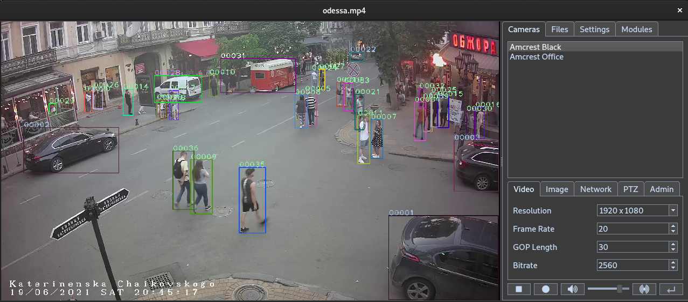

libonvif
========

A client side implementation of the ONVIF specification for Linux and Windows.
Included are two tools for communicating with cameras, a command line program,
onvif-util, and a program with a Graphical User Interface, onvi-gui.

If installing this project on Windows, please use 
[Anaconda](https://www.anaconda.com/) 
with [Visual Studio](https://visualstudio.microsoft.com/) and 
[CMake](https://cmake.org/) installed.

&nbsp;

## Quick Start

<details>
<summary>onvif-gui <i>(Graphical User Interface)</i></summary>
&nbsp;

---

### Step 1. Install Dependecies

* ### Linux
  ```
  sudo apt install cmake g++ python3-pip libxml2-dev libavdevice-dev libsdl2-dev '^libxcb.*-dev' libxkbcommon-x11-dev
  ```

* ### Windows (use Anaconda prompt)
  ```
  conda install -c conda-forge libxml2 ffmpeg libsdl2
  ```

### Step 2. Install onvif-gui
```
pip install onvif-gui
```

### Step 3. Launch program
```
onvif-gui
```
---
&nbsp;
</details>


<details>
<summary>onvif-util <i>(Command Line Tool)</i></summary>
&nbsp;

---

### Step 1. Install Dependencies

* ### Linux
  ```
  sudo apt install git cmake g++ libxml2-dev
  ```

* ### Windows (use Anaconda prompt)
  ```
  conda install -c conda-forge git libxml2
  ```

### Step 2. Install onvif-util

* ### Linux

  ```
  git clone --recursive https://github.com/sr99622/libonvif
  cd libonvif
  mkdir build
  cd build
  cmake -DWITHOUT_PYTHON=ON ..
  make
  sudo make install
  ```

* ### Windows (use Anaconda prompt)

  ```
  git clone --recursive https://github.com/sr99622/libonvif
  cd libonvif
  mkdir build
  cd build
  cmake -DWITHOUT_PYTHON=ON -DCMAKE_INSTALL_PREFIX=%CONDA_PREFIX%\Library ..
  cmake --build . --config Release
  cmake --install .
  ```

### Step 3. Test the program

```
onvif-util -a
```

### Step 4. Get program help

```
onvif-util -h
```

---
&nbsp;

</details>

<details>

<summary>Build From Source</summary>
&nbsp;

---

### Step 1. Install Dependencies

* ### Linux
  ```
  sudo apt install git cmake g++ python3-pip libxml2-dev libavdevice-dev libsdl2-dev '^libxcb.*-dev' libxkbcommon-x11-dev
  ```

* ### Windows (use Anaconda prompt)

  Please create a conda environment for dependencies

  ```
  conda create --name myenv -c conda-forge python git ffmpeg sdl2 libxml2
  conda activate myenv
  ```

### Step 2. Clone Reposistory and Install

```
git clone --recursive https://github.com/sr99622/libonvif
cd libonvif/libonvif
pip install .
cd ../libavio
pip install .
cd ../onvif-gui
pip install .
```

### Step 3. Launch Program

```
onvif-gui
```

---

&nbsp;
</details>

<details>
<summary>Virtual Environments</summary>
&nbsp;

---
Using a virtual environment is strongly recommended. The complexity of this program
and its use of external modules introduces the possibilty of name space collisions 
that may cause the program to crash or behave in an unexpected manner.  These issues 
may be easily avoided by using a dedicated virtual envrionment for installing the 
program.
&nbsp;
On Windows, the use of Anaconda to install the program will use a virtual
environment.  It is suggested to create a dedicated environment for the program.
&nbsp;
On Linux, the use of [virtualenv](https://virtualenv.pypa.io/en/latest/) is recommended. 
This is a very simple tool to use that can be set up easily.

```
pip install virtualenv
virtualenv myenv
source myenv
```

These commands will set up a virtual environment that can be used to install and 
run the program in a safe manner.  Files used by the environment will be kept in
the directory myenv.
&nbsp;
To exit the virtual environment, use

```
deactivate
```

---
&nbsp;
</details>

<details>
<summary>Installation Issues</summary>
&nbsp;

---
The modules this project are distributed as source packages.  They are compiled
on the host machine and require a proper environment to build successfully.  The
instructions above should result in an environment that will host a successful
compilation.
<p>
A common error that may be observed is

```
from cmake import cmake
ModuleNotFoundError: No module named 'cmake'
```

This is caused by the pip version of cmake installed in the environment.  The 
presence of pip version of cmake will cause the compilation to fail.  To remedy
this error, remove the pip version of cmake

```
pip uninstall cmake
```

---
&nbsp;
</details>

<details>
<summary>Alternate Compilation Techniques</summary>
&nbsp;

---
Configuration issues may cause build steps to fail.  In some cases, it is possible
to continue with installation using other methods than those listed above. They
may be successful where other techniques have not if issues are confined to a 
specific tool.  These instructions assume that the Dependencies have been installed
as per Build From Source.

* ### Configure directly using cmake

```
cd libonvif
sudo rm -R build
mkdir build
cd build
cmake ..
make
cd ../onvif-gui
python run.py
```

* ### Invoke setup.py directly

```
cd libonvif/libonvif
python setup.py install 
cd ../libavio
python setup.py install
cd ../onvif-gui
python setup.py install
onvif-gui
```

---
&nbsp;
</details>

&nbsp;

## Onvif GUI Program

<details>
<summary>Getting Started</summary>
&nbsp;

---

<p>
To get started, click the Discovery button, which is the second button from the right
at the bottom of the screen.  A login screen will appear for each camera as it is found.
The Settings tab may be used to set a default login that can be used automatically.
<p>
Upon completion of discovery, the camera list will be populated. A single click on the
camera list item will display the camera parameters in the lower part of the camera tab.
Double clicking the camera name in the list will display the camera video output. 
<p>
Camera parameters are available on the tabs on the lower right side of the application. 
Once a parameter has been changed, the Apply button will be enabled, which can be used 
to commit the change to the camera.  It may be necessary to re-start the video output 
stream in order to see the changes.  The Apply button is found in the lower right hand
corner below the tabs.

---

&nbsp;

</details>

<details>
<summary>Application Settings</summary>
&nbsp;

---

- Auto Discovery - When checked, the application will automatcally start discovery upon launch, 
  otherwise use the Discover button.
- Common Username - Default username used during discover.
- Common Password - Default password used during discover.
- Hardware Decoder - If available, can be set to use GPU video decoding.
- Video Filter - FFMPEG filter strings may be used to modify the video
- Direct Rendering - May be used in Windows to increase performance
- Convert to RGB - The default setting is ON, may be turned on for performance
- Disable Audio, Disable Video - Used to limit streams to a single medium
- Post Process Record - Recording will be the encoded video stream rather than raw packets
- Hardware Encode - If available, use the GPU for encoding
- Process Frame - Video frame data is processed by the sample python module
- Low Latency - Reduces the buffer size to reduce latency, may cause instability
- Pre-Record Cache Size - A cache of media packets is stored locally prior to decoding and will
  be pre-pended to the file stream when Pre Process recording.  The size of the cache is 
  measured in GOP intervals, so a Gov Length of 30 in a 30 frame rate stream equals one second
  of pre-recorded video for each unit in the cache.
- Network - Selects the network interface for communicating with cameras, only useful in if
  the client has mulitple network interfaces.

---
&nbsp;
</details>

<details>
<summary>Adjustable Parameters</summary>
&nbsp;

---

Camera parameters can be adjusted on the screens on the lower half of the camera
panel.  Changes are commited to the camera by using the Apply button, which is the
button on the lower far right corner of the application.  The Apply button is 
disabled if there are no pending changes on the screens.  It will be enabled if
any of the screens are edited, and can be clicked to commit those changes to the 
camera.

* ### Video:

  - Resolution  
  - Frame Rate  
  - Gov Length  
  - Bitrate  

* ### Image:

  - Brightness
  - Saturation
  - Contrast
  - Sharpness

* ### Network:

    If the DHCP is enabled, all fields are set by the server, if DHCP is disabled, other 
    network settings may be completed manually.  Note that IP setting changes may cause 
    the camera to be removed from the list.  Use the Discover button to find the camera.
    Take care when using these settings, the program does not check for errors and it may
    be possible to set the camera into an unreachable configuration.

    - IP Address
    - Subnet Mask
    - Gateway
    - Primary DNS

* ### PTZ:

    Settings pertain to preset selections or current camera position.  The arrow keys, 
    Zoom In and Zoom out control the position and zoom. The numbered buttons on the left 
    correspond to preset positions.  The blank text box may be used to address presets 
    numbered higher than 5. To set a preset, position the camera, then check Set Preset, 
    then click the numbered preset button.

* ### Admin:

    - Camera Name  - Changes the application display name of the camera.
    - Set admin Password - Can be used to change the password for the camera.
    - Sync Time - Reset the camera's current time without regard to time zone.
    - Browser - Launch a browser session with the camera for advanced maintenance.
    - Enable Reboot - Enable the reboot button for use.  Camera will be removed from list.
    - Enable Reset - Enable the reset button for use.  Use with caution, all camera 
      settings will be reset.

---
&nbsp;
</details>

<details>
<summary>Example Operation</summary>
&nbsp;

---
To change the video resolution of a camera output, Double click on the camera name in 
the list.  The camera video output should display in the viewer.  Select the Video tab 
and use the drop down box labelled Resolution.  Upon changing the selection, the Apply 
button will be enabled.  Click the Apply button to make the change.  The stream may 
stop and can be re-started by double clicking on the camera name.
<p>
If camera is not repsonding to a particular command, or a command needed is not present 
on the tool, go to the Admin tab and click the browser button.  This will launch the 
browser using the camera IP address.  Log into the camera and settings should be 
avialable in native format for the camera configuration.

---

&nbsp;

</details>

<details>
<summary>Notes</summary>
&nbsp;

---
Camera compliance with the onvif standard is often incomplete and in some cases 
incorrect. Success with the onvif-util may be limited in many cases. Cameras 
made by Hikvision will have the greatest level of compatibility with onvif-util. 
Cameras made by Dahua will have a close degree of compatability with some notable 
exceptions regarding gateway and DNS settings. Time settings may not be reliable 
in some cases. If the time is set without the zone flag, the time appearing in 
the camera feed will be synced to the computer time. If the time zone flag is used, 
the displayed time may be set to an offset from the computer time based on the 
timezone setting of the camera.
<p>
If the camera DNS setting is properly onvif compliant, the IP address may be reliably 
set. Some cameras may not respond to the DNS setting requested by onvif_gui due 
to non compliance. Note that the camera may reboot automatically under some conditions 
if the DNS setting is changed from off to on.  
<p>
Video settings are reliable. The Admin Password setting is reliable, as well as the reboot 
command. If there is an issue with a particular setting, it is recommended to connect to 
the camera with a web browser, as most cameras will have a web interface that will allow you 
to make the changes reliably. The gui version has a button on the Admin tab that will launch 
the web browser with the camera ip address automatically.


---

&nbsp;

</details>

&nbsp;
<div align="center"></div>
&nbsp;

## Modules

<details>

<summary>Entended Functionality</summary>
&nbsp;

---

* ### Video Stream Processing

onvif-gui has a facility for incorporating python programs to operate on the
video stream.  The Modules tab is the user interface for this feature. 
<p>
Developers may extend the functionality of onvif-gui by writing a python
module that conforms to the class template used by the program.
<p>
There is a minimal example program called sample.py that demonstrates how 
data is trsansferred from the main program to the python module and it's GUI i
nterface implementation.
<p>
The program comes with pre-installed modules that may be enabled by following
the installation instructions following.

* ### YOLOX with ByteTrack

There is included with onvif-gui a full implementation of the YOLOX algorithm
along with an associated tracking algorithm known as ByteTrack.  These algorithms 
are implemented using pytorch, which requires some specific configuration, see
Module Installation for details.
<p>
Please note that if running a customized model, the model name parameter must be 
set to match the model depth.  For example if the custom model using yolox_m 
format, the Model Name parameter must be set to yolox_m.  The error message
'Error(s) in loading state_dict for YOLOX' is typical for the failure to 
correctly match these parameters.

* ### Detectron2

Instance Segmentation and Keypoint discovery are implemented using 
[detectron2](https://github.com/facebookresearch/detectron2)

---

&nbsp;

</details>

<details>

<summary>Module Installation</summary>
&nbsp;

---
Pre-installed modules require pytorch and other depenencies in order to run.  A
virtual environment is recommended.

```
pip install torch torchvision torchaudio --index-url https://download.pytorch.org/whl/cu117 pyqt6 fvcore cloudpickle pycocotools fairscale timm omegaconf opencv-python scipy lap loguru cython cython_bbox_fix iopath fvcore
```
---
&nbsp;

</details>


<details>

<summary>Performance Considerations</summary>
&nbsp;

---

* ### Module Run Time

When running these algorithms, bear in mind that they are computationally expensive.
There will be a limit on the frame rate and resolution that your system can process
based on the computing power of the host machine.  
<p>
The amount of time a module spends running during each frame is displayed for a 
module during execution.  The frame rate of the module is the inverse of this
number.  Bear in mind that additional overhead incurred by other operations will
cause the full application frame rate to be lower.

* ### Performance Tuning

Module run time can be managed by adjusting key parameters.  Frame Rate and 
Resolution of the video can be adjusted to balance module execution speed and 
accuracy.  Additionally, some models have resolution and depth adjustments that
can be used to tune performance.

* ### Adjusting Video Frame Rate

Limiting the frame rate can be done on cameras using the video settings tab.  Frame 
rate on files can be set by using the filter command 'fps=10' where 10 is the desired 
frame rate.  

* ### Adjusting Video Resolution

Likewise, resolution can be set on files with the video filter
using the scale directive, i.e. 'scale=1280x720'.  Consecutive video filters can
be run using a comma as delimiter between the commands, i.e. 'fps=10,scale=1280x720'.

---

&nbsp;
</details>

<details>
<summary>Writing Your Own Modules</summary>
&nbsp;

---
Modules allow developers to ectend the functionality of onvif-gui.  The video 
stream frames are accessible from a python program configured to operate within 
the onvif-gui framework.  Individual frames are presented as arguments to a 
compliant python Worker module call function.
<p>
No special processing is required to access the frame data, it is presented in
numpy format, which is compatible with python constucts such as opencv or PIL
image formats.
<p>
The modules consist of two classes, a Configuration class, which must inherit
the QWidget object, and a Worker class, which has a default __call__ function
to receive the frame data.
<p>
A user defined folder can be specified to hold the module source code.  Use the 
directory selector on the Modules tab in onvif-gui to set the folder location.
<p>
Please consult the sample.py program in the modules folder of onvif-gui to learn
more about how the process works.

---
&nbsp;
</details>

&nbsp;


## Onvif Utility Program

<details>
<summary>Description</summary>
&nbsp;

---
View and set parameters on onvif compatible IP cameras. The command may be used to 
find and identify cameras, and then to create an interactive session that can be 
used to query and set camera properties. 

```
onvif-util

-a, --all
    show all cameras on the network

-h, --help
    show the help for this command

-u, --user 
    set the username for the camera login

-p, --password
    set the password for the camera login
```

To view all cameras on the network:
```
onvif-util -a
```

To login to a particular camera:
```
onvif-util -u username -p password ip_address
```

To login to a camera with safe mode disabled:
```
onvif-util -s -u username -p password ip_address
```


---

&nbsp;
</details>

<details>
<summary>Data Retrieval Commands</summary>
&nbsp;

---

Once logged into the camera you can view data using the 'get' command followed by 
the data requested. The (n) indicates an optional profile index to apply the setting, 
otherwise the current profile is used

- get rtsp 'pass'(optional) (n) - Get rtsp uri for camera, with optional password credential
- get capabilities
- get time
- get profiles
- get profile (n)
- get video (n)
- get video options (n)
- get imaging
- get imaging options
- get network

---
&nbsp;
</details>

<details>
<summary>Parameter Settings</summary>
&nbsp;

---

Once logged into the camera you can set parameters using the 'set' command followed by 
the parameters. The (n) indicates an optional profile index to apply the setting, 
otherwise the current profile is used

- set resolution (n) - Resolution setting in the format widthxheight, must match option
- set framerate (n)
- set gov_length (n)
- set bitrate (n)
- set bightness value(required)
- set contrast value(required)
- set saturation value(required)
- set sharpness value(required)
- set ip_address value(required)
- set default_gateway value(required)
- set dns value(required)
- set dhcp value(required) - Accepted settings are 'on' and 'off'
- set password value(required)

---
&nbsp;
</details>

<details>
<summary>Maintenance Commands</summary>
&nbsp;

---
- help
- safe - set safe mode on.  Viewer and browser are disabled
- unsafe - set safe mode off.  Viewer and browser are enabled
- browser - Use browser to access camera configurations
- view (n) - View the camera output using ffplay (ffplay must be installed in the path)
- view player (n) - View the camera output with user specified player e.g. view vlc
- sync_time 'zone'(optional) - Sync the camera time to the computer
- dump - Full set of raw data from camera configuration
- reboot
- quit - To Exit Camera Session

---
&nbsp;
</details>

<details>
<summary>Examples</summary>
&nbsp;

    > onvif-util -a

      Looking for cameras on the network...
      Found 8 cameras
      192.168.1.18 localhost(TV TV-IP319PI)
      192.168.1.7 (IPC-BO IPC-122)
      192.168.1.14 IPC(Dahua IPC-HDW4631C-A)
      192.168.1.6 IPC(Amcrest IP2M-841EB)
      192.168.1.12 (AXIS M1065-LW)
      192.168.1.12 (AXIS M1065-LW)
      192.168.1.2 IPC(Amcrest IP3M-HX2W)
      192.168.1.11 R2(IPC-model)

    To start a session with a camera, use the login credentials

    > onvif-util -u admin -p admin123 192.168.1.12

      found host: 192.168.1.12
      successfully connected to host
        name:   AXIS M1065-LW
        serial: ACCC8E99C915

    Get current settings for video

    > get video

      Profile set to profile_1_h264

      Resolution: 1920 x 1080
      Frame Rate: 25
      Gov Length: 30
      Bit Rate:   4096

    Get available video settings

    > get video options

      Available Resolutions
        1920 x 1080
        1280 x 720
        640 x 480
        320 x 240
      Min Gov Length: 1
      Max Gov Length: 32767
      Min Frame Rate: 1
      Max Frame Rate: 30
      Min Bit Rate: 1
      Max Bit Rate: 2147483647

    Set video resolution

    > set resolution 1280x720

      Resolution was set to 1280 x 720

    Exit session

    > quit
</details>
&nbsp;


## Licenses

<details>
<summary>libonvif - <i>LGPLv2</i></summary>
&nbsp;

---

 Copyright (c) 2018, 2020, 2022, 2023 Stephen Rhodes 

 License: LGPLv2

 This library is free software; you can redistribute it and/or
 modify it under the terms of the GNU Lesser General Public
 License as published by the Free Software Foundation; either
 version 2.1 of the License, or (at your option) any later version.
 
 This library is distributed in the hope that it will be useful,
 but WITHOUT ANY WARRANTY; without even the implied warranty of
 MERCHANTABILITY or FITNESS FOR A PARTICULAR PURPOSE.  See the GNU
 Lesser General Public License for more details.
 
 You should have received a copy of the GNU Lesser General Public
 License along with this library; if not, write to the Free Software
 Foundation, Inc., 51 Franklin Street, Fifth Floor, Boston, MA 02110-1301 USA

 ---

 &nbsp;

</details>

<details>
<summary>libavio - <i>Apache</i></summary>
&nbsp;

---

 libavio Copyright (c) 2022, 2023 Stephen Rhodes

 License: Apache

 Licensed under the Apache License, Version 2.0 (the "License");
 you may not use this file except in compliance with the License.
 You may obtain a copy of the License at

    http://www.apache.org/licenses/LICENSE-2.0

 Unless required by applicable law or agreed to in writing, software
 distributed under the License is distributed on an "AS IS" BASIS,
 WITHOUT WARRANTIES OR CONDITIONS OF ANY KIND, either express or implied.
 See the License for the specific language governing permissions and
 limitations under the License.

---

&nbsp;
</details>

<details>
<summary>getopt-win.h - <i>BSD-2-Clause-NETBSD</i></summary>
&nbsp;

---

 getopt-win.h (originally getopt.h) Copyright (c) 2002 Todd C. Miller <Todd.Miller@courtesan.com> and Copyright (c) 2000 The NetBSD Foundation, Inc.

 License: BSD-2-Clause-NETBSD

 Redistribution and use in source and binary forms, with or without
 modification, are permitted provided that the following conditions
 are met:
 1. Redistributions of source code must retain the above copyright
    notice, this list of conditions and the following disclaimer.
 2. Redistributions in binary form must reproduce the above copyright
    notice, this list of conditions and the following disclaimer in
    the documentation and/or other materials provided with the
    distribution.
 .
 THIS SOFTWARE IS PROVIDED BY THE NETBSD FOUNDATION, INC. AND
 CONTRIBUTORS ``AS IS'' AND ANY EXPRESS OR IMPLIED WARRANTIES,
 INCLUDING, BUT NOT LIMITED TO, THE IMPLIED WARRANTIES OF
 MERCHANTABILITY AND FITNESS FOR A PARTICULAR PURPOSE ARE DISCLAIMED.
 IN NO EVENT SHALL THE FOUNDATION OR CONTRIBUTORS BE LIABLE FOR ANY
 DIRECT, INDIRECT, INCIDENTAL, SPECIAL, EXEMPLARY, OR CONSEQUENTIAL
 DAMAGES (INCLUDING, BUT NOT LIMITED TO, PROCUREMENT OF SUBSTITUTE
 GOODS OR SERVICES; LOSS OF USE, DATA, OR PROFITS; OR BUSINESS
 INTERRUPTION) HOWEVER CAUSED AND ON ANY THEORY OF LIABILITY, WHETHER
 IN CONTRACT, STRICT LIABILITY, OR TORT (INCLUDING NEGLIGENCE OR
 OTHERWISE) ARISING IN ANY WAY OUT OF THE USE OF THIS SOFTWARE, EVEN
 IF ADVISED OF THE POSSIBILITY OF SUCH DAMAGE.

---

&nbsp;
</details>

<details>
<summary>cencode - <i>Public Domain</i></summary>
&nbsp;
---

 cencode.h, cencode.c in Public Domain by Chris Venter : chris.venter[anti-spam]gmail.com 

 License: public-domain1

 Copyright-Only Dedication (based on United States law) or Public
 Domain Certification
 
 The person or persons who have associated work with this document
 (the "Dedicator" or "Certifier") hereby either (a) certifies that, to
 the best of his knowledge, the work of authorship identified is in
 the public domain of the country from which the work is published, or
 (b) hereby dedicates whatever copyright the dedicators holds in the
 work of authorship identified below (the "Work") to the public
 domain. A certifier, moreover, dedicates any copyright interest he
 may have in the associated work, and for these purposes, is described
 as a "dedicator" below.
 
 A certifier has taken reasonable steps to verify the copyright status
 of this work. Certifier recognizes that his good faith efforts may
 not shield him from liability if in fact the work certified is not in
 the public domain.
 
 Dedicator makes this dedication for the benefit of the public at
 large and to the detriment of the Dedicator's heirs and
 successors. Dedicator intends this dedication to be an overt act of
 relinquishment in perpetuity of all present and future rights under
 copyright law, whether vested or contingent, in the Work. Dedicator
 understands that such relinquishment of all rights includes the
 relinquishment of all rights to enforce (by lawsuit or otherwise)
 those copyrights in the Work.
 
 Dedicator recognizes that, once placed in the public domain, the Work
 may be freely reproduced, distributed, transmitted, used, modified,
 built upon, or otherwise exploited by anyone for any purpose,
 commercial or non-commercial, and in any way, including by methods
 that have not yet been invented or conceived.

---

&nbsp;
</details>

<details>
<summary>sha1 - <i>Public Domain</i></summary>
&nbsp;

---

 sha1.h, sha1.c in Public Domain by By Steve Reid <steve@edmweb.com>

 License: public-domain2
 
 100% Public Domain.

---

&nbsp;
</details>


<details>
<summary>YOLOX - <i>Apache</i></summary>
&nbsp;

---

 YOLOX 
 Copyright (c) 2021-2022 Megvii Inc. All rights reserved.

 License: Apache

 Licensed under the Apache License, Version 2.0 (the "License");
 you may not use this file except in compliance with the License.
 You may obtain a copy of the License at

     http://www.apache.org/licenses/LICENSE-2.0

 Unless required by applicable law or agreed to in writing, software
 distributed under the License is distributed on an "AS IS" BASIS,
 WITHOUT WARRANTIES OR CONDITIONS OF ANY KIND, either express or implied.
 See the License for the specific language governing permissions and
 limitations under the License.

## Cite YOLOX
If you use YOLOX in your research, please cite our work by using the following BibTeX entry:

```latex
 @article{yolox2021,
  title={YOLOX: Exceeding YOLO Series in 2021},
  author={Ge, Zheng and Liu, Songtao and Wang, Feng and Li, Zeming and Sun, Jian},
  journal={arXiv preprint arXiv:2107.08430},
  year={2021}
}
```
## In memory of Dr. Jian Sun
Without the guidance of [Dr. Sun Jian](http://www.jiansun.org/), YOLOX would not have been released and open sourced to the community.
The passing away of Dr. Sun Jian is a great loss to the Computer Vision field. We have added this section here to express our remembrance and condolences to our captain Dr. Sun.
It is hoped that every AI practitioner in the world will stick to the concept of "continuous innovation to expand cognitive boundaries, and extraordinary technology to achieve product value" and move forward all the way.

<div align="center"></div>
没有孙剑博士的指导，YOLOX也不会问世并开源给社区使用。
孙剑博士的离去是CV领域的一大损失，我们在此特别添加了这个部分来表达对我们的“船长”孙老师的纪念和哀思。
希望世界上的每个AI从业者秉持着“持续创新拓展认知边界，非凡科技成就产品价值”的观念，一路向前。

---

&nbsp;
</details>

<details>
<summary>ByteTrack - <i>MIT</i></summary>
&nbsp;

---

ByteTrack

MIT License

Copyright (c) 2021 Yifu Zhang

Permission is hereby granted, free of charge, to any person obtaining a copy
of this software and associated documentation files (the "Software"), to deal
in the Software without restriction, including without limitation the rights
to use, copy, modify, merge, publish, distribute, sublicense, and/or sell
copies of the Software, and to permit persons to whom the Software is
furnished to do so, subject to the following conditions:

The above copyright notice and this permission notice shall be included in all
copies or substantial portions of the Software.

THE SOFTWARE IS PROVIDED "AS IS", WITHOUT WARRANTY OF ANY KIND, EXPRESS OR
IMPLIED, INCLUDING BUT NOT LIMITED TO THE WARRANTIES OF MERCHANTABILITY,
FITNESS FOR A PARTICULAR PURPOSE AND NONINFRINGEMENT. IN NO EVENT SHALL THE
AUTHORS OR COPYRIGHT HOLDERS BE LIABLE FOR ANY CLAIM, DAMAGES OR OTHER
LIABILITY, WHETHER IN AN ACTION OF CONTRACT, TORT OR OTHERWISE, ARISING FROM,
OUT OF OR IN CONNECTION WITH THE SOFTWARE OR THE USE OR OTHER DEALINGS IN THE
SOFTWARE.

---

&nbsp;
</details>


<details>
<summary>detectron2 - <i>Apache</i></summary>
&nbsp;

---

detectron2

Detectron2 is released under the Apache 2.0 license.

Copyright (c) Facebook, Inc. and its affiliates.

Citing Detectron2

If you use Detectron2 in your research or wish to refer to the baseline results published in the Model Zoo, please use the following BibTeX entry.

```bash
@misc{wu2019detectron2,
  author =       {Yuxin Wu and Alexander Kirillov and Francisco Massa and
                  Wan-Yen Lo and Ross Girshick},
  title =        {Detectron2},
  howpublished = {\url{https://github.com/facebookresearch/detectron2}},
  year =         {2019}
}
```

---

&nbsp;
</details>